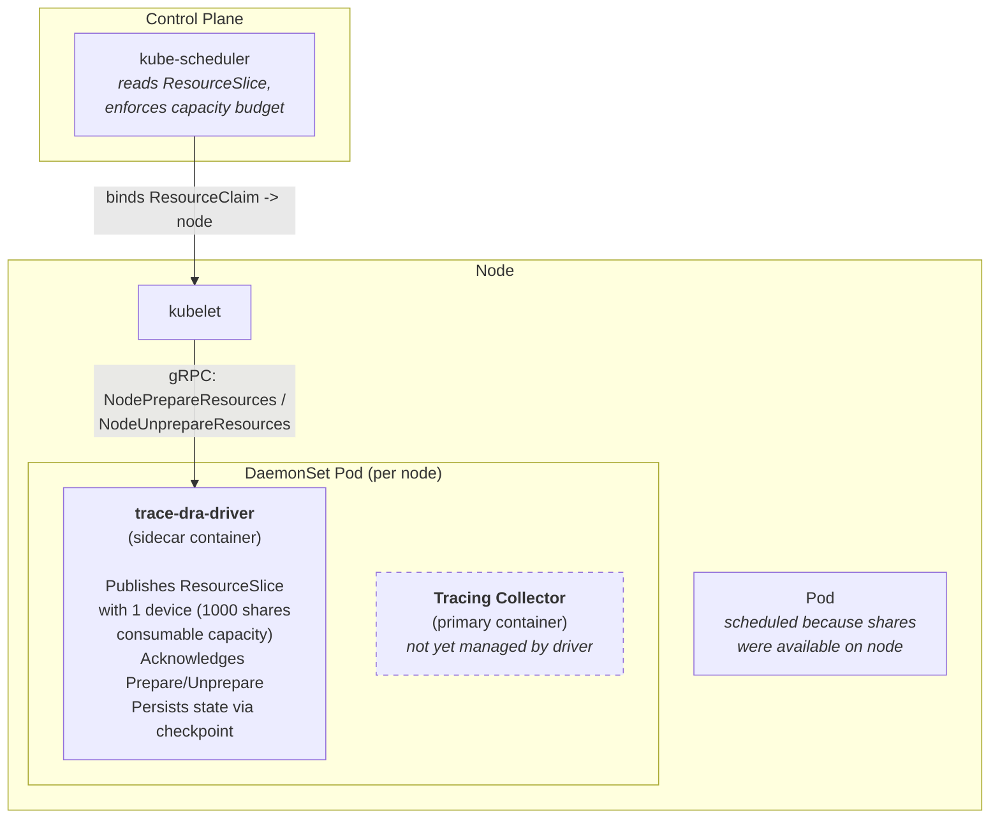
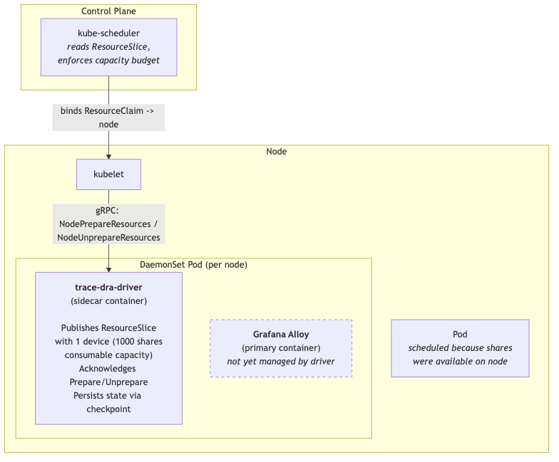
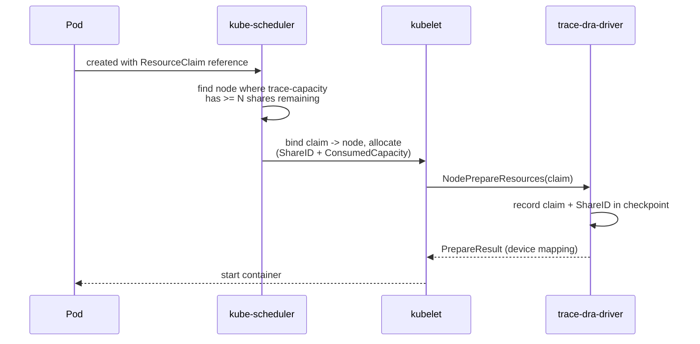
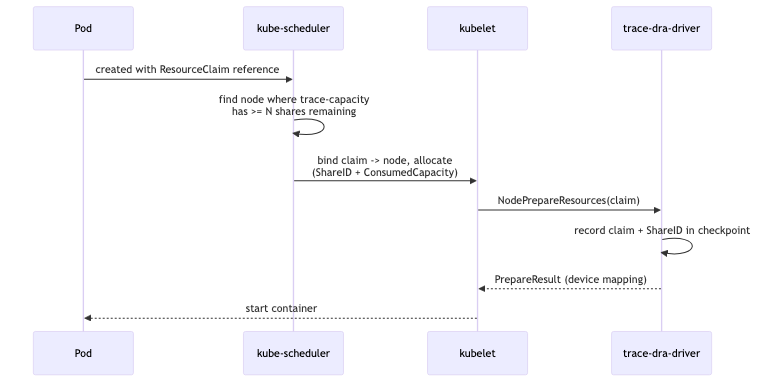
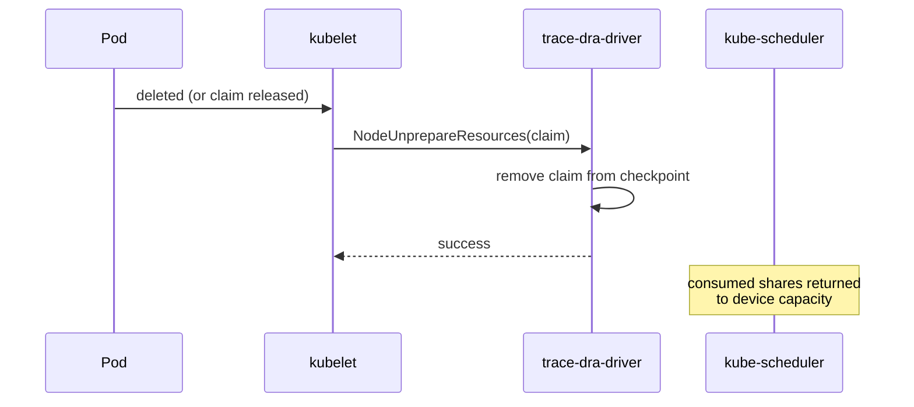
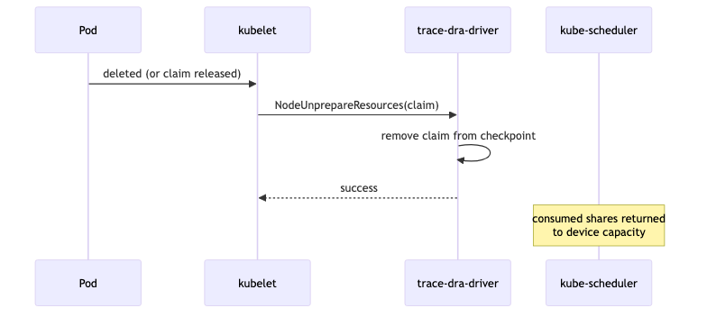
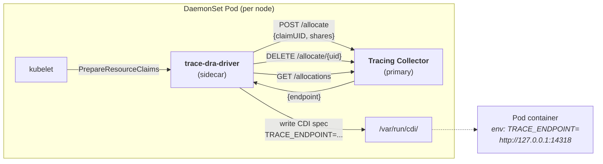
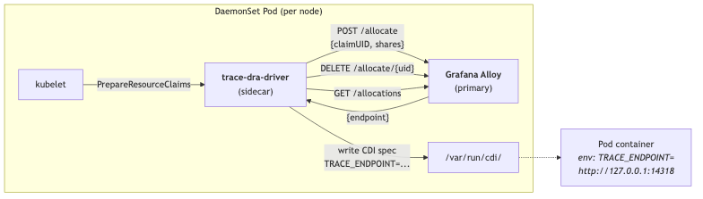

# Trace DRA Driver

A Kubernetes Dynamic Resource Allocation (DRA) kubelet plugin that
models per-node trace processing capacity as a single device with
consumable shares.

---

## Table of Contents

- [Problem Statement](#problem-statement)
- [Scope](#scope)
- [Deployment Model](#deployment-model)
- [Solution](#solution)
- [Resource Model](#resource-model)
  - [Consumable Capacity](#consumable-capacity)
  - [Two Usage Patterns](#two-usage-patterns)
  - [DeviceClass](#deviceclass)
- [Allocation Flow](#allocation-flow)
- [Deallocation Flow](#deallocation-flow)
- [Key Design Principles](#key-design-principles)
- [Technology Stack](#technology-stack)
- [Repository Structure](#repository-structure)
- [Milestone 1: Driver + ResourceSlice + Deployment](#milestone-1----driver--resourceslice--deployment)
- [Milestone 2: Claim Lifecycle + Example Workloads](#milestone-2----claim-lifecycle--example-workloads)
- [Milestone 3: Checkpoint + Crash Recovery](#milestone-3----checkpoint--crash-recovery)
- [Future Work: Collector Listener Management](#future-work----collector-listener-management)

---

## Problem Statement

Kubernetes workloads need to consume trace processing capacity from a
node-local collector (e.g. OpenTelemetry Collector, Grafana Alloy).
Each collector instance has finite throughput -- bounded by its
CPU/memory limits and internal queue depths -- yet today there is no
scheduler-aware mechanism to:

1. Advertise that bounded processing capacity as a consumable
   per-node resource.
2. Let the scheduler enforce "total allocated shares <= capacity"
   before placing a pod.
3. Reclaim capacity when a pod terminates.

## Scope

**Share management only.** The driver publishes per-node trace
capacity as a single DRA device with consumable capacity. The
Kubernetes scheduler handles all capacity math -- the driver just
acknowledges Prepare/Unprepare lifecycle calls and persists state for
crash recovery.

## Deployment Model

The DRA driver runs as a **sidecar container** alongside the
node-local tracing collector in a shared DaemonSet pod. This
co-location means:

- Both containers share the kubelet plugin socket volumes.
- A single DaemonSet manages the full per-node trace infrastructure.

## Solution

A **Kubernetes Dynamic Resource Allocation (DRA) kubelet plugin** that
models trace capacity as a single device with consumable capacity,
using the `DRAConsumableCapacity` feature gate (alpha in k8s 1.35).
Pods can consume capacity via explicit ResourceClaims or via the
`DRAExtendedResource` feature gate's extended resource syntax.





---

## Resource Model

### Consumable Capacity

Each node advertises a **single device** named `trace-capacity` with
`allowMultipleAllocations: true` and a consumable `shares` capacity
of 1000. The scheduler deducts requested shares from the device's
available capacity on each allocation.

```
Device "trace-capacity"
  allowMultipleAllocations: true
  capacity:
    shares:
      value: 1000
      requestPolicy:
        default: 1       (claim that omits shares gets 1)
        validRange:
          min: 1          (at least 1 share per claim)
```

Multiple ResourceClaims can allocate from the same device
concurrently. Each allocation receives a unique `ShareID` and
records its `ConsumedCapacity`. The scheduler tracks the running
total and rejects claims when capacity is exhausted.

### Two Usage Patterns

The driver supports two ways for pods to consume trace capacity.
Both produce the same end result (shares consumed from the device),
but differ in how users express the request and how the scheduler
structures the allocation.

| Pattern | How the user requests | Allocation results | Total shares consumed |
|---|---|---|---|
| **Explicit ResourceClaim** | `capacity.requests.shares: 50` | 1 result with `ConsumedCapacity: {shares: 50}` | 50 |
| **Extended Resource** | `resources.requests: {trace.example.com: 50}` | 50 results, each with `ConsumedCapacity: {shares: 1}` (the default) | 50 |

The driver's Prepare/Unprepare code handles both patterns
identically by iterating over all allocation results. No
pattern-specific logic is needed.

#### Pattern 1: Explicit ResourceClaim

A pod requesting 50 shares creates a ResourceClaim:

```yaml
apiVersion: resource.k8s.io/v1
kind: ResourceClaim
metadata:
  name: my-traces
spec:
  devices:
    requests:
    - name: trace-shares
      exactly:
        deviceClassName: trace.example.com
        capacity:
          requests:
            shares: 50
```

The scheduler finds a node where `trace-capacity` has >= 50 shares
remaining and consumes them. The allocation result carries a unique
`ShareID` and `ConsumedCapacity: {shares: 50}`.

#### Pattern 2: DRA Extended Resource (KEP-5004)

The `DRAExtendedResource` feature gate (alpha in k8s 1.34) allows
pods to consume DRA devices using the traditional `resources.requests`
syntax -- no explicit ResourceClaim needed.

A DeviceClass with `extendedResourceName` maps the device class to
a Kubernetes extended resource name:

```yaml
apiVersion: resource.k8s.io/v1
kind: DeviceClass
metadata:
  name: trace.example.com
spec:
  selectors:
  - cel:
      expression: "device.driver == 'trace.example.com'"
  extendedResourceName: trace.example.com
```

Pods then request trace capacity like any other resource:

```yaml
apiVersion: v1
kind: Pod
metadata:
  name: trace-consumer
spec:
  containers:
  - name: app
    image: myapp:latest
    resources:
      requests:
        trace.example.com: 50
```

Behind the scenes, the scheduler auto-creates a "special"
ResourceClaim with `count: 50`. Because the device's
`requestPolicy.default` is 1, each of the 50 allocations consumes
1 share, for a total of 50. The driver sees the same
Prepare/Unprepare gRPC calls regardless of which pattern was used.

**No driver-side changes are needed** to support extended resources.
The driver publishes the same ResourceSlice, handles the same gRPC
calls, and iterates over allocation results identically. The only
difference is the DeviceClass manifest (adding `extendedResourceName`)
and how the user writes their pod spec.

Note: even without `extendedResourceName`, any DeviceClass
automatically gets an implicit extended resource name of
`deviceclass.resource.kubernetes.io/<device-class-name>`. The
explicit `extendedResourceName` field provides a shorter, more
user-friendly name.

### DeviceClass

```yaml
apiVersion: resource.k8s.io/v1
kind: DeviceClass
metadata:
  name: trace.example.com
spec:
  selectors:
  - cel:
      expression: "device.driver == 'trace.example.com'"
  extendedResourceName: trace.example.com    # enables extended resource syntax
```

---

## Allocation Flow





No collector interaction, no CDI injection. The scheduler did all the
capacity enforcement; the driver just acknowledges.

## Deallocation Flow





---

## Key Design Principles

1. **Scheduler is authoritative for capacity math.** The driver never
   does admission control on share counts. It publishes device
   capacity; the scheduler decides what fits.
2. **All operations are idempotent.** PrepareResourceClaims with an
   already-prepared claim returns the cached result.
3. **Crash recovery via checkpoint.** The driver persists prepared
   claims to a checkpoint file. On restart, it reloads state so
   repeated Prepare calls remain idempotent.
4. **Minimal surface area.** No external dependencies (no collector
   communication, no CDI injection). The driver is a pure
   share-accounting plugin.

## Technology Stack

| Component | Version | Purpose |
|---|---|---|
| Go | 1.25+ | Implementation language |
| [ko](https://ko.build/) | latest | Container image builder (no Dockerfile) |
| Kubernetes | 1.35+ | `DRAConsumableCapacity` feature gate (alpha) |
| `k8s.io/dynamic-resource-allocation` | v0.35.0 | DRA kubelet plugin library |
| `k8s.io/api` | v0.35.0 | `resource.k8s.io` types |
| `k8s.io/client-go` | v0.35.0 | Kubernetes API client |
| `k8s.io/klog/v2` | v2.130.1 | Structured logging |

### Required Feature Gates

All three must be enabled on kube-apiserver, kube-scheduler, and kubelet:

- `DynamicResourceAllocation` (GA in 1.34)
- `DRAConsumableCapacity` (alpha in 1.35)
- `DRAExtendedResource` (alpha in 1.34) -- only needed if using
  the extended resource pod syntax (Pattern 2)

---

## Repository Structure

```
k8s-dra-driver-trace-collector/
├── go.mod
├── go.sum
├── .ko.yaml                         # ko build configuration
├── main.go                          # Entrypoint, plugin lifecycle
├── driver/
│   ├── driver.go                    # DRAPlugin implementation
│   ├── resourceslice.go             # Device + capacity, ResourceSlice building
│   └── checkpoint.go                # Crash-recovery state persistence
├── deploy/
│   ├── daemonset.yaml               # DaemonSet: collector + driver sidecar
│   ├── rbac.yaml                    # ServiceAccount, ClusterRole, Binding
│   └── deviceclass.yaml             # DeviceClass for trace.example.com
├── example/
│   ├── explicit-claim.yaml          # Example: ResourceClaim + Pod
│   └── extended-resource.yaml       # Example: Pod with extended resource syntax
└── specs/
    └── 000-trace-capacity.md        # This file
```

---

## Milestone Summary

| # | Milestone | Key Deliverable | kind Test |
|---|---|---|---|
| 1 | Driver + ResourceSlice + Deployment | Running DaemonSet, visible ResourceSlice | `kubectl get resourceslices` shows the device |
| 2 | Claim Lifecycle + Example Workloads | Prepare/Unprepare, example pods | Pods schedule, capacity enforced, over-allocation blocked |
| 3 | Checkpoint + Crash Recovery | Persistent state across restarts | Kill driver, verify recovery |

---

# Milestone 1 -- Driver + ResourceSlice + Deployment

## Goal

Initialize the Go module, implement the driver entrypoint, publish
a ResourceSlice with a single consumable-capacity device, and deploy
everything to a kind cluster via DaemonSet + RBAC + DeviceClass +
Dockerfile.

At the end of this milestone:
- The driver runs as a sidecar in a DaemonSet alongside the tracing
  collector.
- `kubectl get resourceslices` shows one device `trace-capacity`
  with 1000 consumable shares.
- Prepare/Unprepare are stubs (fleshed out in M2).

## Acceptance Criteria

- [ ] `go build ./...` succeeds.
- [ ] `go vet ./...` passes.
- [ ] `ko build .` produces a working container image.
- [ ] `KO_DOCKER_REPO=ko.local ko apply -f deploy/` creates all
      resources without error.
- [ ] Driver pod starts on each node and reaches Running state.
- [ ] `kubectl get resourceslices` shows a single slice owned by the
      driver on the node.
- [ ] The slice contains one device `trace-capacity` with
      `allowMultipleAllocations: true` and `capacity.shares.value: 1000`.
- [ ] Driver exits cleanly on SIGTERM.
- [ ] Unit tests pass: `go test ./...`.

---

## 1.1 -- go.mod

Module path: `github.com/<org>/k8s-dra-driver-trace-collector`
(placeholder, the actual org is determined at repo creation time).

### Direct dependencies

All `k8s.io/*` modules pinned to the same release to avoid skew.

```
k8s.io/api                         v0.35.0
k8s.io/apimachinery                v0.35.0
k8s.io/client-go                   v0.35.0
k8s.io/dynamic-resource-allocation v0.35.0
k8s.io/klog/v2                     v2.130.1
k8s.io/kubelet                     v0.35.0
k8s.io/utils                       latest
```

---

## 1.2 -- main.go

### Responsibilities

1. Read configuration from environment variables:

   | Env Var | Default | Required | Purpose |
   |---|---|---|---|
   | `NODE_NAME` | -- | yes | Downward API, identifies this node |
   | `DRIVER_NAME` | `trace.example.com` | no | DRA driver name |
   | `TOTAL_SHARES` | `1000` | no | Per-node capacity |

2. Create in-cluster Kubernetes clientset.

3. Construct the `Driver` struct.

4. Call `kubeletplugin.Start()`:

   ```go
   helper, err := kubeletplugin.Start(
       ctx,
       drv,
       kubeletplugin.DriverName(driverName),
       kubeletplugin.KubeClient(clientset),
       kubeletplugin.NodeName(nodeName),
   )
   ```

   This creates two Unix domain sockets:
   - `/var/lib/kubelet/plugins_registry/<driver>-reg.sock` --
     kubelet discovers the plugin here.
   - `/var/lib/kubelet/plugins/<driver>/dra.sock` -- kubelet sends
     Prepare/Unprepare gRPC calls here.

5. Call `helper.PublishResources()` with the device inventory built
   by `driver.BuildResources()`.

6. Block on SIGTERM/SIGINT via `signal.NotifyContext`.

7. On shutdown: call `helper.Stop()`.

### Stub DRAPlugin methods

`PrepareResourceClaims` and `UnprepareResourceClaims` return empty
results in M1. `HandleError` logs and exits on fatal errors. These
are fleshed out in M2.

### Skeleton

```go
func main() {
    // 1. Read env
    nodeName := mustEnv("NODE_NAME")
    driverName := envOr("DRIVER_NAME", "trace.example.com")
    totalShares := envIntOr("TOTAL_SHARES", 1000)

    // 2. Signal context
    ctx, cancel := signal.NotifyContext(context.Background(),
        syscall.SIGTERM, syscall.SIGINT)
    defer cancel()

    // 3. Kubernetes client
    cfg, _ := rest.InClusterConfig()
    clientset, _ := kubernetes.NewForConfig(cfg)

    // 4. Driver
    drv := driver.New(nodeName, driverName, totalShares, cancel)

    // 5. Start kubelet plugin
    helper, _ := kubeletplugin.Start(ctx, drv, ...)

    // 6. Publish resource inventory
    helper.PublishResources(ctx, drv.BuildResources())

    // 7. Wait for shutdown
    <-ctx.Done()
    helper.Stop()
}
```

---

## 1.3 -- driver/resourceslice.go

### BuildResources()

Returns a `resourceslice.DriverResources` describing the single
device for this node.

```go
func (d *Driver) BuildResources() resourceslice.DriverResources
```

#### Device with consumable capacity

One device named `trace-capacity` with `AllowMultipleAllocations`
set to `true` and a `shares` capacity:

```go
device := resourceapi.Device{
    Name:                     "trace-capacity",
    AllowMultipleAllocations: ptr.To(true),
    Basic: &resourceapi.BasicDevice{
        Attributes: map[resourceapi.QualifiedName]resourceapi.DeviceAttribute{
            "type": {StringValue: ptr.To("trace-capacity")},
        },
        Capacity: map[resourceapi.QualifiedName]resourceapi.DeviceCapacity{
            "shares": {
                Value: resource.MustParse(strconv.Itoa(d.totalShares)),
                RequestPolicy: &resourceapi.CapacityRequestPolicy{
                    Default: ptr.To(resource.MustParse("1")),
                    ValidRange: &resourceapi.CapacityRequestPolicyRange{
                        Min: ptr.To(resource.MustParse("1")),
                    },
                },
            },
        },
    },
}
```

The `RequestPolicy` defines:
- **Default: 1** -- a claim that omits `capacity.requests.shares`
  gets 1 share.
- **ValidRange.Min: 1** -- every claim must consume at least 1 share.
- **No Max** -- a single claim could theoretically consume all 1000.
- **No Step** -- any integer from 1 to remaining capacity is valid.

#### No slicing needed

With consumable capacity, the entire node's trace budget is a single
device. There is no need to split across multiple ResourceSlice
objects (the old model required ~8 slices for 1000 devices at 128
per slice). One slice, one device.

#### Pool

One pool per node. Pool name = node name (standard convention):

```go
return resourceslice.DriverResources{
    Pools: map[string]resourceslice.Pool{
        d.nodeName: {
            Slices: []resourceslice.Slice{{
                Devices: []resourceapi.Device{device},
            }},
        },
    },
}
```

The `kubeletplugin.Helper` handles creating the actual ResourceSlice
API objects. The driver never touches the API directly.

### ResourceSlice YAML (what the scheduler sees)

```yaml
apiVersion: resource.k8s.io/v1
kind: ResourceSlice
metadata:
  name: <auto-generated>
  ownerReferences:
  - apiVersion: v1
    kind: Node
    name: worker-1
spec:
  driver: trace.example.com
  pool:
    name: worker-1
  devices:
  - name: trace-capacity
    allowMultipleAllocations: true
    basic:
      attributes:
        type:
          string: "trace-capacity"
      capacity:
        shares:
          value: "1000"
          requestPolicy:
            default: "1"
            validRange:
              min: "1"
```

### Unit tests

`driver/resourceslice_test.go`:

| Test | Assertion |
|---|---|
| `TestBuildResources_Default` | 1 device named `trace-capacity`, 1 slice, 1 pool |
| `TestBuildResources_AllowMultipleAllocations` | Device has `AllowMultipleAllocations == true` |
| `TestBuildResources_Capacity` | `capacity["shares"].Value` equals total shares (1000) |
| `TestBuildResources_RequestPolicy` | Default is 1, ValidRange.Min is 1 |
| `TestBuildResources_CustomShares` | `totalShares=500` -> capacity value is 500 |

---

## 1.4 -- driver/driver.go (Stub)

Minimal struct with placeholder methods so `kubeletplugin.Start()`
has something to call:

```go
type Driver struct {
    nodeName    string
    driverName  string
    totalShares int
    cancelFunc  context.CancelFunc
}

func New(nodeName, driverName string, totalShares int,
    cancel context.CancelFunc) *Driver { ... }

// Stub -- fleshed out in M2.
func (d *Driver) PrepareResourceClaims(
    ctx context.Context,
    claims []*resourceapi.ResourceClaim,
) (map[types.UID]kubeletplugin.PrepareResult, error) {
    return nil, nil
}

// Stub -- fleshed out in M2.
func (d *Driver) UnprepareResourceClaims(
    ctx context.Context,
    claims []kubeletplugin.NamespacedObject,
) (map[types.UID]error, error) {
    return nil, nil
}

func (d *Driver) HandleError(ctx context.Context, err error, msg string) {
    if errors.Is(err, kubeletplugin.ErrRecoverable) {
        klog.ErrorS(err, "recoverable plugin error", "msg", msg)
        return
    }
    klog.ErrorS(err, "fatal plugin error, shutting down", "msg", msg)
    d.cancelFunc()
}
```

---

## 1.5 -- deploy/deviceclass.yaml

```yaml
apiVersion: resource.k8s.io/v1
kind: DeviceClass
metadata:
  name: trace.example.com
spec:
  selectors:
  - cel:
      expression: "device.driver == 'trace.example.com'"
  extendedResourceName: trace.example.com
```

Cluster-scoped. Must exist before any ResourceClaim or extended
resource request references it.

The `extendedResourceName` field enables Pattern 2 (extended resource
syntax). Without it, pods would need to use explicit ResourceClaims.
Even without this field, the implicit extended resource name
`deviceclass.resource.kubernetes.io/trace.example.com` would work,
but the explicit name is shorter and more user-friendly.

---

## 1.6 -- deploy/rbac.yaml

```yaml
apiVersion: v1
kind: ServiceAccount
metadata:
  name: trace-dra-driver
  namespace: trace-dra-test
---
apiVersion: rbac.authorization.k8s.io/v1
kind: ClusterRole
metadata:
  name: trace-dra-driver
rules:
- apiGroups: ["resource.k8s.io"]
  resources: ["resourceclaims"]
  verbs: ["get"]
- apiGroups: ["resource.k8s.io"]
  resources: ["resourceslices"]
  verbs: ["get", "list", "watch", "create", "update", "patch", "delete"]
- apiGroups: [""]
  resources: ["nodes"]
  verbs: ["get"]
---
apiVersion: rbac.authorization.k8s.io/v1
kind: ClusterRoleBinding
metadata:
  name: trace-dra-driver
roleRef:
  apiGroup: rbac.authorization.k8s.io
  kind: ClusterRole
  name: trace-dra-driver
subjects:
- kind: ServiceAccount
  name: trace-dra-driver
  namespace: trace-dra-test
```

### Permission rationale

| Resource | Verbs | Why |
|---|---|---|
| `resourceclaims` | `get` | `kubeletplugin.Helper` fetches the full claim before Prepare |
| `resourceslices` | full CRUD | Helper publishes/updates/deletes device inventory |
| `nodes` | `get` | Helper looks up node UID for owner references |

---

## 1.7 -- deploy/daemonset.yaml

Two-container DaemonSet: the tracing collector as the primary
container, the DRA driver as a sidecar. The driver does not
communicate with the collector -- they simply co-locate in the
same pod.

```yaml
apiVersion: apps/v1
kind: DaemonSet
metadata:
  name: trace-collector
  namespace: trace-dra-test
  labels:
    app: trace-collector
spec:
  selector:
    matchLabels:
      app: trace-collector
  template:
    metadata:
      labels:
        app: trace-collector
    spec:
      serviceAccountName: trace-dra-driver
      priorityClassName: system-node-critical
      containers:
      - name: collector
        image: otel/opentelemetry-collector:latest    # or any compatible collector
        ports:
        - containerPort: 4317
          name: otlp-grpc
        - containerPort: 4318
          name: otlp-http
        resources:
          requests:
            cpu: 100m
            memory: 128Mi
          limits:
            cpu: 500m
            memory: 512Mi
      - name: driver
        image: ko://github.com/<org>/k8s-dra-driver-trace-collector
        securityContext:
          privileged: true
        env:
        - name: NODE_NAME
          valueFrom:
            fieldRef:
              fieldPath: spec.nodeName
        - name: DRIVER_NAME
          value: "trace.example.com"
        - name: TOTAL_SHARES
          value: "1000"
        volumeMounts:
        - name: plugins-registry
          mountPath: /var/lib/kubelet/plugins_registry
        - name: plugins
          mountPath: /var/lib/kubelet/plugins
        resources:
          requests:
            cpu: 50m
            memory: 64Mi
          limits:
            cpu: 200m
            memory: 128Mi
      volumes:
      - name: plugins-registry
        hostPath:
          path: /var/lib/kubelet/plugins_registry
          type: Directory
      - name: plugins
        hostPath:
          path: /var/lib/kubelet/plugins
          type: DirectoryOrCreate
```

### Design decisions

| Decision | Rationale |
|---|---|
| Two containers | Collector is the primary workload; DRA driver is the sidecar |
| `privileged: true` (driver only) | Required for kubelet plugin socket access on hostPath |
| `system-node-critical` | DRA drivers are node infrastructure; must not be preempted |
| No CDI volume mount | No CDI specs produced in this phase |
| Two hostPath volumes | `plugins_registry` for registration socket, `plugins` for DRA socket + checkpoint |
| Collector has no volume mounts | The driver does not interact with the collector |
| Shared pod network | Driver can reach collector at `localhost` when listener management is added |

---

## 1.8 -- .ko.yaml

Container images are built with [ko](https://ko.build/), which
compiles the Go binary and packages it into a distroless base image
automatically. No Dockerfile needed.

```yaml
defaultBaseImage: gcr.io/distroless/static:nonroot
```

ko resolves `ko://` image references in YAML manifests, builds the
Go binary, and pushes the resulting image. For local kind testing,
`KO_DOCKER_REPO=ko.local` makes ko load images directly into the
kind cluster without a registry.

### Why ko

- **No Dockerfile to maintain.** ko handles multi-stage build,
  static linking, and distroless base image automatically.
- **One-step build + deploy.** `ko apply -f deploy/` builds the
  image and applies the manifests in a single command.
- **Multi-arch for free.** `--platform=linux/amd64,linux/arm64`
  with no Dockerfile changes.
- **SBOMs by default.** ko generates an SBOM for every image.

---

## 1.9 -- kind Test Procedure

```bash
# 1. Create kind cluster with feature gates
cat <<EOF | kind create cluster --name trace-dra-test --config=-
kind: Cluster
apiVersion: kind.x-k8s.io/v1alpha4
featureGates:
  DynamicResourceAllocation: true
  DRAConsumableCapacity: true
  DRAExtendedResource: true
EOF

# 2. Create namespace and deploy
kubectl --context kind-trace-dra-test create namespace trace-dra-test
KO_DOCKER_REPO=ko.local ko apply --context kind-trace-dra-test -f deploy/

# 3. Verify
kubectl --context kind-trace-dra-test -n trace-dra-test get pods -l app=trace-collector
# STATUS: Running

kubectl --context kind-trace-dra-test -n trace-dra-test get resourceslices -o yaml
# Should show 1 device "trace-capacity" with:
#   allowMultipleAllocations: true
#   capacity.shares.value: "1000"
```

---

## M1 Deliverables

| File | Contents |
|---|---|
| `go.mod` | Module declaration + k8s.io dependencies |
| `main.go` | Entrypoint: env parsing, client, plugin start, signal wait |
| `driver/driver.go` | `Driver` struct + stub DRAPlugin methods |
| `driver/resourceslice.go` | `BuildResources()` producing 1 device with consumable capacity |
| `driver/resourceslice_test.go` | Unit tests for device + capacity configuration |
| `.ko.yaml` | ko build configuration (base image) |
| `deploy/deviceclass.yaml` | DeviceClass with `extendedResourceName` |
| `deploy/rbac.yaml` | ServiceAccount, ClusterRole, ClusterRoleBinding |
| `deploy/daemonset.yaml` | Two-container DaemonSet (collector + driver sidecar) |

---

# Milestone 2 -- Claim Lifecycle + Example Workloads

## Goal

Implement the real `PrepareResourceClaims` and
`UnprepareResourceClaims` methods, add example workloads for both
consumption patterns, and verify scheduler-enforced capacity in a
kind cluster.

The implementation handles both allocation patterns transparently:

| Pattern | Allocation results per claim |
|---|---|
| Explicit ResourceClaim (`capacity.requests.shares: 50`) | 1 result with `ConsumedCapacity: {shares: 50}` |
| Extended Resource (`resources.requests: {trace.example.com: 50}`) | 50 results, each with `ConsumedCapacity: {shares: 1}` |

## Acceptance Criteria

- [ ] When a pod with a trace ResourceClaim is scheduled to the node,
      `PrepareResourceClaims` succeeds and the pod starts.
- [ ] When the pod is deleted, `UnprepareResourceClaims` succeeds and
      the shares become available for new claims.
- [ ] Both explicit ResourceClaim and extended resource allocation
      patterns produce correct results.
- [ ] Calling `PrepareResourceClaims` twice for the same claim is
      idempotent (returns same result).
- [ ] Calling `UnprepareResourceClaims` for an unknown claim is a
      no-op (returns nil error).
- [ ] Concurrent calls are safe (mutex-protected).
- [ ] Example pods schedule and start in kind.
- [ ] Over-allocation causes pod to stay Pending; freeing shares
      unblocks it.
- [ ] Unit tests pass: `go test ./...`.

---

## 2.1 -- Driver State

Add an in-memory map tracking prepared claims. Each claim records
a list of `PreparedDevice` entries -- one per allocation result for
our driver. This naturally handles both 1-result (explicit claim)
and N-result (extended resource) patterns.

```go
type Driver struct {
    nodeName       string
    driverName     string
    totalShares    int
    checkpointPath string
    cancelFunc     context.CancelFunc

    mu       sync.Mutex
    prepared map[types.UID]*PreparedClaim
}

// PreparedClaim is the driver's record of a claim that has been
// prepared on this node. It stores one PreparedDevice per
// DeviceRequestAllocationResult that belongs to this driver.
type PreparedClaim struct {
    ClaimUID  types.UID
    Namespace string
    Name      string
    Devices   []PreparedDevice
}

// PreparedDevice records a single allocation result from the
// scheduler. For explicit ResourceClaims with consumable capacity,
// there is typically 1 device with a large ConsumedCapacity. For
// extended resource claims, there are N devices each consuming the
// default (1 share).
type PreparedDevice struct {
    Request          string // original request name
    Pool             string // pool name (= node name)
    Device           string // device name ("trace-capacity")
    ShareID          string // unique share allocation ID (from scheduler)
    ConsumedCapacity int64  // shares consumed by this allocation result
}

// TotalShares returns the sum of ConsumedCapacity across all devices
// in this claim.
func (pc *PreparedClaim) TotalShares() int64 {
    var total int64
    for _, d := range pc.Devices {
        total += d.ConsumedCapacity
    }
    return total
}
```

---

## 2.2 -- PrepareResourceClaims

```go
func (d *Driver) PrepareResourceClaims(
    ctx context.Context,
    claims []*resourceapi.ResourceClaim,
) (map[types.UID]kubeletplugin.PrepareResult, error)
```

### Algorithm

For each claim in the batch:

1. **Idempotency check.** Lock `d.mu`, check if `d.prepared[claim.UID]`
   exists. If yes, build and return the cached result immediately.

2. **Collect allocation results.** Iterate
   `claim.Status.Allocation.Devices.Results`. For each entry where
   `result.Driver == d.driverName`, create a `PreparedDevice`:

   ```go
   pd := PreparedDevice{
       Request: result.Request,
       Pool:    result.Pool,
       Device:  result.Device,
   }
   if result.ShareID != nil {
       pd.ShareID = string(*result.ShareID)
   }
   if result.ConsumedCapacity != nil {
       if shares, ok := result.ConsumedCapacity["shares"]; ok {
           pd.ConsumedCapacity = shares.Value()
       }
   }
   ```

   This works identically for both patterns:
   - Explicit claim: 1 result, `ConsumedCapacity: {shares: 50}`
   - Extended resource: 50 results, each `ConsumedCapacity: {shares: 1}`

3. **Build device mappings.** For each `PreparedDevice`, create a
   `kubeletplugin.Device`:

   ```go
   kubeletplugin.Device{
       Requests:   []string{pd.Request},
       PoolName:   pd.Pool,
       DeviceName: pd.Device,
       // CDIDeviceIDs left empty -- no injection needed for share management.
   }
   ```

4. **Record in `d.prepared`.** Store the `PreparedClaim` with
   claim metadata and all `PreparedDevice` entries.

5. **Return `PrepareResult`.** The result for this claim UID contains
   the `Devices` slice (no `Err`).

### Empty CDIDeviceIDs

With no CDI spec files, the `CDIDeviceIDs` field is empty. The
kubelet accepts this -- it just means no container device injection
happens. The pod still starts; it just does not receive any
environment variables from the driver. This is correct for
share-management-only mode.

### Error Handling

If the claim has no allocation status, or the allocation contains
zero results for our driver, return `PrepareResult{Err: ...}` for
that claim UID. The kubelet will report the error and may retry.

---

## 2.3 -- UnprepareResourceClaims

```go
func (d *Driver) UnprepareResourceClaims(
    ctx context.Context,
    claims []kubeletplugin.NamespacedObject,
) (map[types.UID]error, error)
```

### Algorithm

For each claim:

1. **Lock `d.mu`.** Delete `d.prepared[claim.UID]` if present.
2. **Return nil error** for the claim UID regardless (idempotent).

No external cleanup is needed. The scheduler handles freeing the
device allocations; the driver just forgets its local state.

### Why Unprepare Receives NamespacedObject, Not ResourceClaim

The kubelet may call Unprepare after the ResourceClaim API object has
already been deleted. The `NamespacedObject` carries the UID,
namespace, and name from the kubelet's own records, so the driver
can look up its local state without an API call.

---

## 2.4 -- Logging

All Prepare/Unprepare calls are logged with structured fields:

```go
klog.InfoS("preparing claim",
    "claimUID", claim.UID,
    "namespace", claim.Namespace,
    "name", claim.Name,
    "allocationResults", len(devices),
    "totalShares", preparedClaim.TotalShares())

klog.InfoS("unpreparing claim",
    "claimUID", claim.UID)
```

Idempotent cache hits are logged at verbosity 2:

```go
klog.V(2).InfoS("claim already prepared, returning cached result",
    "claimUID", claim.UID)
```

---

## 2.5 -- Example 1: Explicit ResourceClaim

`example/explicit-claim.yaml`

This pattern uses the consumable capacity API directly. One
allocation result, consuming 50 shares at once.

```yaml
apiVersion: resource.k8s.io/v1
kind: ResourceClaim
metadata:
  name: my-traces
spec:
  devices:
    requests:
    - name: trace-shares
      exactly:
        deviceClassName: trace.example.com
        capacity:
          requests:
            shares: 50
---
apiVersion: v1
kind: Pod
metadata:
  name: trace-consumer-explicit
spec:
  containers:
  - name: app
    image: busybox:latest
    command: ["sh", "-c", "echo 'I have 50 trace shares (explicit claim)' && sleep 3600"]
    resources:
      claims:
      - name: trace-claim
  resourceClaims:
  - name: trace-claim
    resourceClaimName: my-traces
  restartPolicy: Never
```

---

## 2.6 -- Example 2: Extended Resource

`example/extended-resource.yaml`

This pattern uses the traditional `resources.requests` syntax. The
scheduler auto-creates a ResourceClaim with `count: 50`, producing
50 allocation results each consuming 1 share.

```yaml
apiVersion: v1
kind: Pod
metadata:
  name: trace-consumer-extended
spec:
  containers:
  - name: app
    image: busybox:latest
    command: ["sh", "-c", "echo 'I have 50 trace shares (extended resource)' && sleep 3600"]
    resources:
      requests:
        trace.example.com: 50
  restartPolicy: Never
```

No ResourceClaim manifest needed -- the scheduler creates one
automatically.

---

## 2.7 -- Over-allocation Test

This test verifies capacity enforcement works with either pattern.

```bash
# With 50 shares already consumed (from example 1 or 2), try to
# claim 960 more shares:
kubectl --context kind-trace-dra-test -n trace-dra-test apply -f - <<'EOF'
apiVersion: v1
kind: Pod
metadata:
  name: greedy-pod
spec:
  containers:
  - name: app
    image: busybox:latest
    command: ["sleep", "3600"]
    resources:
      requests:
        trace.example.com: 960
  restartPolicy: Never
EOF

# greedy-pod should stay Pending -- scheduler cannot find 960
# available shares when 50 are already consumed (only 950 remain).
kubectl --context kind-trace-dra-test -n trace-dra-test get pod greedy-pod
# STATUS: Pending

# Free shares by deleting the first consumer
kubectl --context kind-trace-dra-test -n trace-dra-test delete pod trace-consumer-explicit  # or trace-consumer-extended
kubectl --context kind-trace-dra-test -n trace-dra-test delete resourceclaim my-traces      # only if using explicit claim

# greedy-pod should now schedule (960 <= 1000)
kubectl --context kind-trace-dra-test -n trace-dra-test get pod greedy-pod
# STATUS: Running
```

---

## 2.8 -- kind Test Procedure

```bash
# (Assumes M1 is already deployed in kind-trace-dra-test)

# 1. Apply example 1 (explicit claim)
kubectl --context kind-trace-dra-test -n trace-dra-test apply -f example/explicit-claim.yaml

# 2. Verify claim allocated
kubectl --context kind-trace-dra-test -n trace-dra-test get resourceclaim my-traces -o yaml
# Status.Allocation.Devices.Results should have 1 entry with:
#   ShareID: <unique-id>
#   ConsumedCapacity: {shares: "50"}

# 3. Verify pod running
kubectl --context kind-trace-dra-test -n trace-dra-test get pod trace-consumer-explicit
# STATUS: Running

# 4. Clean up example 1
kubectl --context kind-trace-dra-test -n trace-dra-test delete pod trace-consumer-explicit
kubectl --context kind-trace-dra-test -n trace-dra-test delete resourceclaim my-traces

# 5. Apply example 2 (extended resource)
kubectl --context kind-trace-dra-test -n trace-dra-test apply -f example/extended-resource.yaml

# 6. Verify auto-created claim
kubectl --context kind-trace-dra-test -n trace-dra-test get resourceclaims
# Should show an auto-generated claim for trace-consumer-extended

# 7. Verify pod running
kubectl --context kind-trace-dra-test -n trace-dra-test get pod trace-consumer-extended
# STATUS: Running

# 8. Over-allocation test (see section 2.7)

# 9. Clean up
kubectl --context kind-trace-dra-test -n trace-dra-test delete pod trace-consumer-extended
kubectl --context kind-trace-dra-test -n trace-dra-test delete pod greedy-pod
```

---

## 2.9 -- Unit Tests

`driver/driver_test.go`:

| Test | Setup | Assertion |
|---|---|---|
| `TestPrepare_ExplicitClaim` | Fake claim with 1 allocation result, `ConsumedCapacity: {shares: 50}` | Returns 1 `Device` entry, `PreparedClaim` has 1 device with `ConsumedCapacity=50`, `TotalShares()=50` |
| `TestPrepare_ExtendedResource` | Fake claim with 50 allocation results, each `ConsumedCapacity: {shares: 1}` | Returns 50 `Device` entries, `PreparedClaim` has 50 devices, `TotalShares()=50` |
| `TestPrepare_Idempotent` | Call Prepare twice with same claim | Second call returns same result, map has 1 entry |
| `TestPrepare_MultiClaim` | Batch of 3 claims | All 3 succeed, map has 3 entries |
| `TestPrepare_NoAllocation` | Claim with nil `Status.Allocation` | Returns `PrepareResult{Err: ...}` |
| `TestPrepare_WrongDriver` | Allocation results for a different driver name | Returns 0 devices (error: no results for our driver) |
| `TestPrepare_ShareID` | Allocation result with `ShareID` set | `PreparedDevice.ShareID` is populated |
| `TestUnprepare_Basic` | Prepare then Unprepare | Map is empty after Unprepare |
| `TestUnprepare_Idempotent` | Unprepare claim that was never prepared | Returns nil error |
| `TestUnprepare_Unknown` | Unprepare random UID | Returns nil error |
| `TestTotalShares` | `PreparedClaim` with mixed consumed capacities | `TotalShares()` returns correct sum |

### Building Fake ResourceClaims

Tests construct `resourceapi.ResourceClaim` objects directly. Two
helpers produce the two allocation patterns:

**Explicit claim pattern (1 result, N shares):**

```go
func fakeExplicitClaim(uid, name, ns string, shares int64) *resourceapi.ResourceClaim {
    return &resourceapi.ResourceClaim{
        ObjectMeta: metav1.ObjectMeta{
            UID:       types.UID(uid),
            Name:      name,
            Namespace: ns,
        },
        Status: resourceapi.ResourceClaimStatus{
            Allocation: &resourceapi.AllocationResult{
                Devices: resourceapi.DeviceAllocationResult{
                    Results: []resourceapi.DeviceRequestAllocationResult{
                        {
                            Request:          "trace-shares",
                            Driver:           "trace.example.com",
                            Pool:             "node-1",
                            Device:           "trace-capacity",
                            ShareID:          ptr.To(types.UID("share-abc")),
                            ConsumedCapacity: map[resourceapi.QualifiedName]resource.Quantity{
                                "shares": resource.MustParse(strconv.FormatInt(shares, 10)),
                            },
                        },
                    },
                },
            },
        },
    }
}
```

**Extended resource pattern (N results, 1 share each):**

```go
func fakeExtendedResourceClaim(uid, name, ns string, count int) *resourceapi.ResourceClaim {
    results := make([]resourceapi.DeviceRequestAllocationResult, count)
    for i := range count {
        results[i] = resourceapi.DeviceRequestAllocationResult{
            Request:          "trace-shares",
            Driver:           "trace.example.com",
            Pool:             "node-1",
            Device:           "trace-capacity",
            ShareID:          ptr.To(types.UID(fmt.Sprintf("share-%04d", i))),
            ConsumedCapacity: map[resourceapi.QualifiedName]resource.Quantity{
                "shares": resource.MustParse("1"),
            },
        }
    }
    return &resourceapi.ResourceClaim{
        ObjectMeta: metav1.ObjectMeta{
            UID:       types.UID(uid),
            Name:      name,
            Namespace: ns,
        },
        Status: resourceapi.ResourceClaimStatus{
            Allocation: &resourceapi.AllocationResult{
                Devices: resourceapi.DeviceAllocationResult{
                    Results: results,
                },
            },
        },
    }
}
```

---

## M2 Deliverables

| File | Contents |
|---|---|
| `driver/driver.go` (updated) | `PreparedClaim`, `PreparedDevice` types, real Prepare/Unprepare methods |
| `driver/driver_test.go` | Unit tests for both allocation patterns and all edge cases |
| `example/explicit-claim.yaml` | ResourceClaim + Pod (Pattern 1) |
| `example/extended-resource.yaml` | Pod with extended resource request (Pattern 2) |

---

# Milestone 3 -- Checkpoint + Crash Recovery

## Goal

Persist prepared-claim state to disk so the driver survives restarts.
On startup the in-memory `prepared` map is rehydrated from the
checkpoint file. This makes repeated `PrepareResourceClaims` calls
idempotent across process boundaries.

## Acceptance Criteria

- [ ] After Prepare, a JSON checkpoint file exists on disk.
- [ ] After driver restart, the checkpoint is loaded and
      `PrepareResourceClaims` for the same claim returns the cached
      result without error.
- [ ] After Unprepare, the claim is removed from the checkpoint.
- [ ] A corrupted/missing checkpoint is treated as empty (clean
      start).
- [ ] Writes are atomic (write-to-temp, then rename).
- [ ] Checkpoint correctly round-trips both explicit claim (1 device,
      N shares) and extended resource (N devices, 1 share each)
      allocation patterns.
- [ ] Unit tests pass: `go test ./...`.
- [ ] kind test: prepare a claim, kill the driver pod, verify
      recovery after restart.

---

## 3.1 -- Checkpoint Format

File: `driver/checkpoint.go`

Location on disk:

```
/var/lib/kubelet/plugins/trace.example.com/checkpoint.json
```

This sits inside the plugin data directory, which is already a
hostPath volume mount in the DaemonSet and survives container
restarts.

### Schema

```json
{
  "version": 1,
  "claims": {
    "<claimUID>": {
      "claimUID": "<claimUID>",
      "namespace": "<namespace>",
      "name": "<name>",
      "devices": [
        {
          "request": "trace-shares",
          "pool": "worker-1",
          "device": "trace-capacity",
          "shareID": "abc-123",
          "consumedCapacity": 50
        }
      ]
    }
  }
}
```

For an explicit ResourceClaim, the `devices` array has 1 entry with
a large `consumedCapacity`. For an extended resource claim, it has
N entries each with `consumedCapacity: 1`.

The `version` field allows future schema migrations.

### Go types

```go
type Checkpoint struct {
    Version int                         `json:"version"`
    Claims  map[string]*CheckpointClaim `json:"claims"`
}

type CheckpointClaim struct {
    ClaimUID  string             `json:"claimUID"`
    Namespace string             `json:"namespace"`
    Name      string             `json:"name"`
    Devices   []CheckpointDevice `json:"devices"`
}

type CheckpointDevice struct {
    Request          string `json:"request"`
    Pool             string `json:"pool"`
    Device           string `json:"device"`
    ShareID          string `json:"shareID,omitempty"`
    ConsumedCapacity int64  `json:"consumedCapacity"`
}
```

Note: `CheckpointDevice` mirrors `PreparedDevice` from M2. The
separation keeps the checkpoint format stable and decoupled from
in-memory representation changes.

---

## 3.2 -- Save

```go
func SaveCheckpoint(path string, cp *Checkpoint) error
```

1. Marshal to indented JSON (human-debuggable).
2. Write to `<path>.tmp`.
3. `os.Rename` tmp -> final path (atomic on POSIX).

If the rename fails, the tmp file is cleaned up best-effort.

This guarantees that a crash mid-write never leaves a half-written
checkpoint. On next load the driver sees either the old complete
file or the new complete file.

---

## 3.3 -- Load

```go
func LoadCheckpoint(path string) (*Checkpoint, error)
```

1. Read file. If `os.IsNotExist`, return empty checkpoint (not an
   error).
2. Unmarshal JSON. If malformed, log a warning and return empty
   checkpoint. A corrupted file should not prevent the driver from
   starting.
3. Validate `Version == 1`. If unknown version, log warning and
   return empty.

---

## 3.4 -- Integration with Driver

### Startup (main.go changes)

After constructing the `Driver`, before `kubeletplugin.Start()`:

```go
drv := driver.New(...)
if err := drv.LoadFromCheckpoint(); err != nil {
    klog.ErrorS(err, "failed to load checkpoint, starting fresh")
}
```

`LoadFromCheckpoint` reads the file and populates `d.prepared`,
converting each `CheckpointClaim` / `CheckpointDevice` back into
`PreparedClaim` / `PreparedDevice`.

### PrepareResourceClaims changes

After adding a new entry to `d.prepared`, save:

```go
d.prepared[claim.UID] = preparedClaim
if err := d.saveCheckpoint(); err != nil {
    klog.ErrorS(err, "checkpoint save failed", "claimUID", claim.UID)
    // Non-fatal: state is in memory. Will be saved on next
    // successful Prepare/Unprepare.
}
```

### UnprepareResourceClaims changes

After deleting from `d.prepared`, save:

```go
delete(d.prepared, claim.UID)
if err := d.saveCheckpoint(); err != nil {
    klog.ErrorS(err, "checkpoint save failed", "claimUID", claim.UID)
}
```

### Helper method

```go
func (d *Driver) saveCheckpoint() error {
    cp := &Checkpoint{
        Version: 1,
        Claims:  make(map[string]*CheckpointClaim, len(d.prepared)),
    }
    for uid, pc := range d.prepared {
        devices := make([]CheckpointDevice, len(pc.Devices))
        for i, pd := range pc.Devices {
            devices[i] = CheckpointDevice{
                Request:          pd.Request,
                Pool:             pd.Pool,
                Device:           pd.Device,
                ShareID:          pd.ShareID,
                ConsumedCapacity: pd.ConsumedCapacity,
            }
        }
        cp.Claims[string(uid)] = &CheckpointClaim{
            ClaimUID:  string(pc.ClaimUID),
            Namespace: pc.Namespace,
            Name:      pc.Name,
            Devices:   devices,
        }
    }
    return SaveCheckpoint(d.checkpointPath, cp)
}
```

The caller holds `d.mu`.

---

## 3.5 -- Failure Scenarios

| Scenario | What Happens |
|---|---|
| Driver crashes after Prepare, checkpoint saved | Restart loads checkpoint. Next Prepare is idempotent. |
| Driver crashes after Prepare, checkpoint NOT saved | Checkpoint is stale (missing the new claim). Kubelet re-calls Prepare; driver re-adds the entry. |
| Driver crashes after Unprepare, checkpoint saved | Claim is gone. Kubelet may re-call Unprepare; driver returns success (idempotent). |
| Driver crashes after Unprepare, checkpoint NOT saved | Checkpoint has stale entry. On restart, `d.prepared` has a ghost entry. Kubelet will not call Prepare for this claim again; on next Unprepare (if it comes) the entry is removed. If no Unprepare comes, the ghost entry is harmless -- it does not affect scheduling (scheduler owns device allocation, not the driver). |
| Kubelet restarts | Kubelet re-calls Prepare for all active claims. Driver returns cached results. |
| Node reboot | Both checkpoint and kubelet state are fresh. Kubelet re-prepares as needed. |
| Checkpoint file deleted manually | Driver starts with empty state. Kubelet re-calls Prepare for active claims. |

### Ghost entries

A ghost entry (claim in checkpoint but no longer active) is benign.
It wastes a few bytes of memory and disk. When listener management
is added, reconciliation logic will actively clean these up. For
now they are acceptable.

---

## 3.6 -- kind Test Procedure

```bash
# (Assumes M1 + M2 are deployed in kind-trace-dra-test,
#  example pods have run successfully)

# 1. Prepare a claim
kubectl --context kind-trace-dra-test -n trace-dra-test apply -f example/explicit-claim.yaml
kubectl --context kind-trace-dra-test -n trace-dra-test get pod trace-consumer-explicit
# STATUS: Running

# 2. Verify checkpoint exists
kubectl --context kind-trace-dra-test -n trace-dra-test exec -c driver \
  $(kubectl --context kind-trace-dra-test -n trace-dra-test get pod -l app=trace-collector -o name | head -1) \
  -- cat /var/lib/kubelet/plugins/trace.example.com/checkpoint.json
# Should show the prepared claim

# 3. Kill the driver container (DaemonSet restarts it)
kubectl --context kind-trace-dra-test -n trace-dra-test exec -c driver \
  $(kubectl --context kind-trace-dra-test -n trace-dra-test get pod -l app=trace-collector -o name | head -1) \
  -- kill 1

# 4. Wait for restart
kubectl --context kind-trace-dra-test -n trace-dra-test get pods -l app=trace-collector -w
# Should restart and reach Running

# 5. Verify checkpoint was loaded (check driver logs)
kubectl --context kind-trace-dra-test -n trace-dra-test logs -c driver \
  $(kubectl --context kind-trace-dra-test -n trace-dra-test get pod -l app=trace-collector -o name | head -1) \
  | grep -i checkpoint
# Should show "loaded checkpoint" with the claim

# 6. Unprepare should still work
kubectl --context kind-trace-dra-test -n trace-dra-test delete pod trace-consumer-explicit
kubectl --context kind-trace-dra-test -n trace-dra-test delete resourceclaim my-traces

# 7. Verify checkpoint is empty
kubectl --context kind-trace-dra-test -n trace-dra-test exec -c driver \
  $(kubectl --context kind-trace-dra-test -n trace-dra-test get pod -l app=trace-collector -o name | head -1) \
  -- cat /var/lib/kubelet/plugins/trace.example.com/checkpoint.json
# Should show {"version":1,"claims":{}}
```

---

## 3.7 -- Unit Tests

`driver/checkpoint_test.go`:

| Test | Description |
|---|---|
| `TestSaveAndLoad_ExplicitClaim` | Save a checkpoint with 1 claim having 1 device (50 shares), load it back, verify equality |
| `TestSaveAndLoad_ExtendedResource` | Save a checkpoint with 1 claim having 50 devices (1 share each), load it back, verify equality |
| `TestSaveAndLoad_Mixed` | Save 3 claims (mix of explicit and extended resource patterns), load back, verify |
| `TestLoadMissing` | Load from non-existent path, get empty checkpoint |
| `TestLoadCorrupted` | Write garbage bytes, load returns empty checkpoint |
| `TestLoadBadVersion` | Write `{"version": 99, ...}`, load returns empty |
| `TestAtomicWrite` | Verify no `.tmp` file remains after successful save |
| `TestRoundTrip` | Prepare 2 claims (one explicit, one extended resource) via driver, save, create new driver, load, verify `prepared` map including `TotalShares()` |

---

## M3 Deliverables

| File | Contents |
|---|---|
| `driver/checkpoint.go` | `Checkpoint`, `CheckpointClaim`, `CheckpointDevice` types, `SaveCheckpoint`, `LoadCheckpoint` |
| `driver/checkpoint_test.go` | Unit tests |
| `driver/driver.go` (updated) | `LoadFromCheckpoint`, `saveCheckpoint`, checkpoint path field |
| `main.go` (updated) | Call `LoadFromCheckpoint` on startup |

---

# Future Work -- Collector Listener Management

This section describes the next evolution of the driver. It is
included to show where the architecture is headed and to ensure the
current design does not paint us into a corner.

The driver currently manages **shares only**. The next step is to
make those shares *do something*: when a claim is prepared, the
driver tells the collector to spin up a trace listener and injects
the listener endpoint into the pod's containers via CDI.





## Per-Claim Listeners

One ResourceClaim = one collector listener. New files:

| File | Purpose |
|---|---|
| `driver/collector_client.go` | HTTP client: Allocate, Deallocate, ListAllocations |
| `driver/cdi.go` | Write/delete CDI spec files with `TRACE_ENDPOINT` |
| `driver/reconcile.go` | Startup reconciliation: checkpoint vs. collector state |

### Collector API Contract

```
POST /allocate
  Body:    {"claimUID": "abc-123", "shares": 50}
  Returns: {"endpoint": "http://127.0.0.1:14318"}
  Status:  201 Created (or 200 if idempotent repeat)

DELETE /allocate/{claimUID}
  Returns: 204 No Content (idempotent)

GET /allocations
  Returns: [{"claimUID": "...", "shares": 50, "port": 14318, ...}]
```

### Reconciliation

On startup, three-way diff between driver checkpoint and collector
state:

| Driver checkpoint | Collector state | Action |
|---|---|---|
| has claim | has claim | verify match |
| has claim | missing | re-create in collector, update CDI |
| missing | has claim | delete orphan from collector |

## Per-Container Listeners

The advanced extension. Each container in a pod gets its own
collector listener with its own port. This enables per-container
trace isolation and per-container rate limiting.

The driver groups `PreparedDevice` entries by their `Request` field
and creates a separate listener per request group. CDI specs inject
per-request `TRACE_ENDPOINT` environment variables into only the
container that referenced that request.

## What the Current Design Preserves for Listener Management

- **`Request` field propagation.** Always carried from allocation
  results into `PrepareResult.Devices[].Requests`, enabling
  per-container listener grouping.
- **`PreparedDevice` extensibility.** `CheckpointDevice` uses
  `omitempty` on optional fields, so adding `Listener *ListenerState`
  is backward-compatible.
- **Checkpoint versioning.** `version: 1` allows future schema
  evolution.
- **`ShareID` and `ConsumedCapacity`.** Needed for per-request
  listener grouping and quota enforcement.
- **CDIDeviceIDs returned from a method.** Not hard-coded empty,
  so the method can be extended to produce real IDs.

---

## Prerequisites

| Requirement | Minimum Version | Notes |
|---|---|---|
| Kubernetes | 1.35+ | `DRAConsumableCapacity` feature gate (alpha) |
| Container runtime | containerd 1.7+ or CRI-O 1.28+ | |
| kubectl | matching cluster version | |

### Required Feature Gates

All must be enabled on kube-apiserver, kube-scheduler, and kubelet:

| Feature Gate | Status | Purpose |
|---|---|---|
| `DynamicResourceAllocation` | GA in 1.34 | Core DRA support |
| `DRAConsumableCapacity` | alpha in 1.35 | Consumable capacity model (1 device, multiple allocations) |
| `DRAExtendedResource` | alpha in 1.34 | Extended resource syntax (only needed for Pattern 2) |
