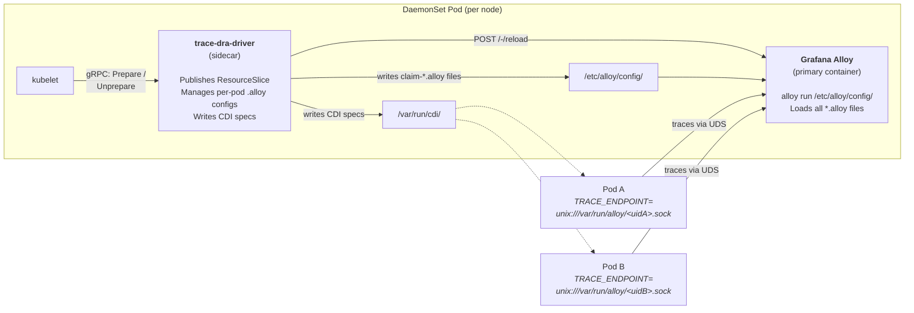
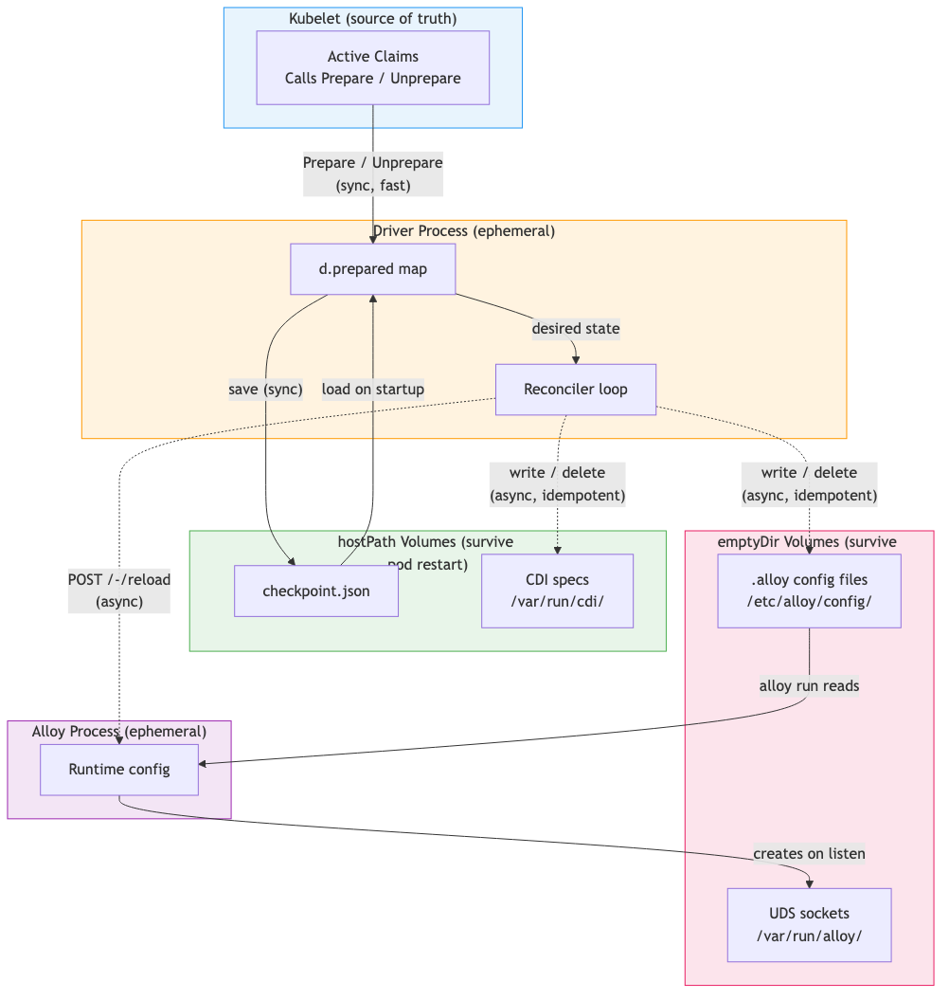
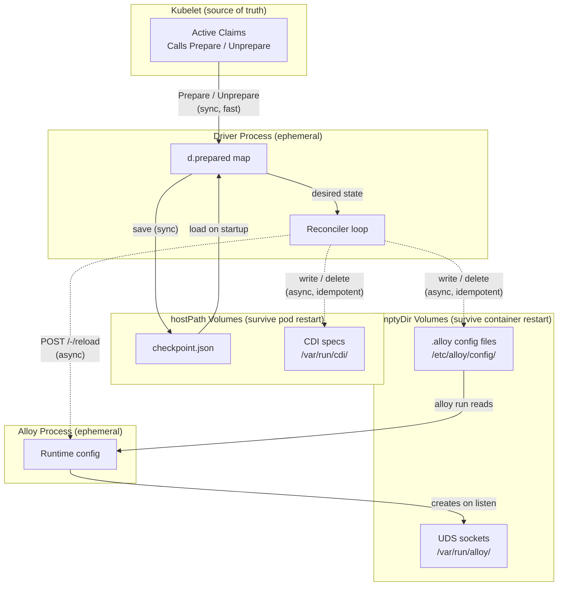
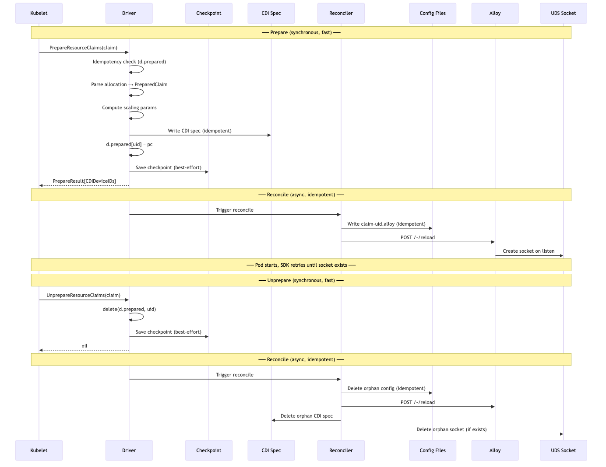
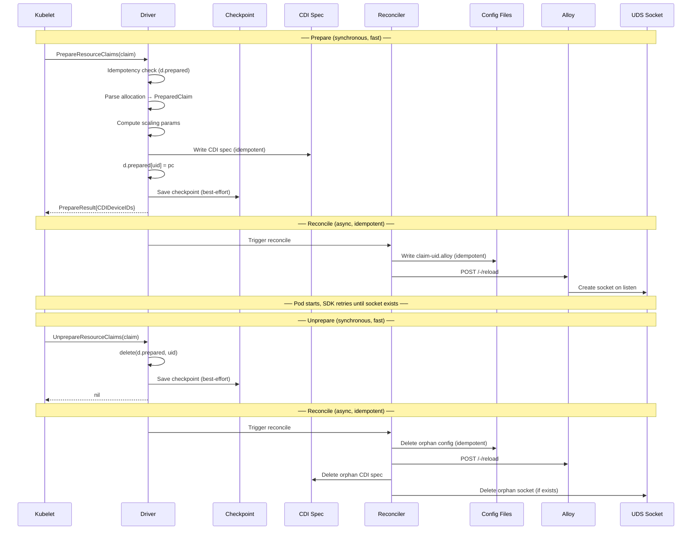
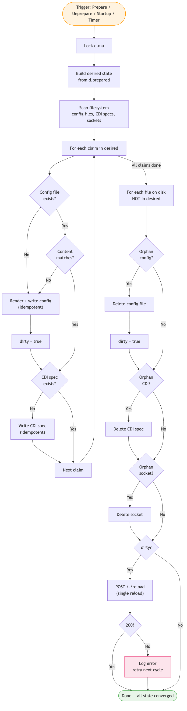
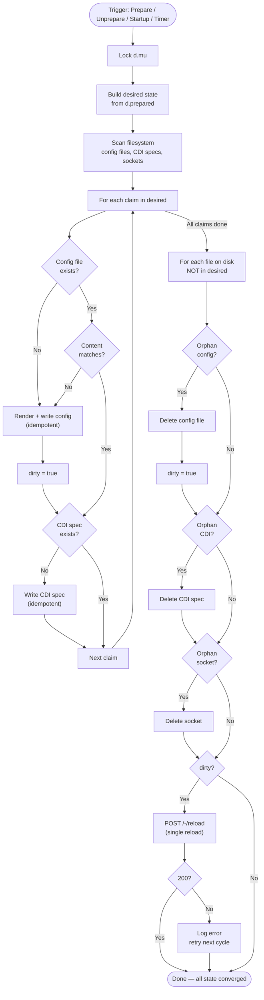

# Alloy Listener Management

Per-pod OTLP ingress listeners managed by the DRA driver sidecar in
Grafana Alloy. Each pod's trace ingress is rate-limited proportional
to the shares it claimed via DRA, enforcing fair-share access to the
node's trace processing capacity.

---

## Table of Contents

- [Problem Statement](#problem-statement)
- [Scope](#scope)
- [Architecture](#architecture)
  - [Container Topology](#container-topology)
  - [Shared Volumes](#shared-volumes)
  - [Per-Pod Pipeline](#per-pod-pipeline)
  - [Admin Pipeline Contract](#admin-pipeline-contract)
- [Per-Pod Config Generation](#per-pod-config-generation)
  - [File Naming](#file-naming)
  - [Component Naming](#component-naming)
  - [Config Template](#config-template)
- [Share-to-Resource Scaling](#share-to-resource-scaling)
  - [Formula](#formula)
  - [Scaled Parameters](#scaled-parameters)
  - [Driver Configuration](#driver-configuration)
    - [API Type](#api-type)
    - [Example Configuration](#example-configuration)
    - [Minimal Configuration](#minimal-configuration)
    - [Defaulting](#defaulting)
    - [Validation](#validation)
    - [Loading](#loading)
  - [Example Values](#example-values)
- [Config Reload and Verification](#config-reload-and-verification)
  - [Reload Flow](#reload-flow)
  - [Error Handling](#error-handling)
  - [Alloy Startup](#alloy-startup)
- [CDI Integration](#cdi-integration)
- [Driver State Machine](#driver-state-machine)
  - [State Stores](#state-stores)
  - [Claim Lifecycle](#claim-lifecycle)
  - [Prepare — Synchronous Steps](#prepare--synchronous-steps)
  - [Unprepare — Synchronous Steps](#unprepare--synchronous-steps)
  - [Reconciler Loop](#reconciler-loop)
  - [Startup Sequence](#startup-sequence)
  - [Crash Scenarios](#crash-scenarios)
  - [Design Decisions](#design-decisions)
- [Milestone 4 -- Per-Pod Listener Lifecycle](#milestone-4----per-pod-listener-lifecycle)
- [Milestone 5 -- Reconciler + Crash Recovery](#milestone-5----reconciler--crash-recovery)
- [Deployment Changes](#deployment-changes)
- [Alternatives Considered](#alternatives-considered)

---

## Problem Statement

Spec 000 gives each pod a fair share of node-local trace capacity
via the Kubernetes scheduler. But the scheduler only enforces
**admission** -- it blocks pods when capacity is exhausted. Once a
pod is admitted, nothing prevents it from sending more telemetry
than its share allows, starving other pods of collector throughput.

This spec closes that gap. When the DRA driver prepares a claim,
it creates a **dedicated OTLP ingress listener** in Grafana Alloy
for that pod, with transport and throughput limits scaled to the
pod's claimed shares. Each pod gets its own Unix domain socket and
cannot exceed its allocated byte rate.

## Scope

- **Ingress only.** The sidecar manages per-pod receivers and rate
  limiters. The admin owns the downstream pipeline (processors,
  batching, exporters). The sidecar never modifies admin config.
- **Traces only.** The per-pod receiver accepts trace signals.
  Metrics and logs are out of scope.
- **Grafana Alloy only.** The config format and reload mechanism
  are Alloy-specific (`.alloy` file syntax, `/-/reload` HTTP API).

---

## Architecture

### Container Topology

The DRA driver sidecar (from spec 000) is extended to manage Alloy
config files. No additional container is added.



### Shared Volumes

| Volume | Mount Path | Type | Used By | Purpose |
|---|---|---|---|---|
| `alloy-config` | `/etc/alloy/config/` | emptyDir | driver (rw), alloy (ro) | Final config directory: admin base + per-pod `claim-*.alloy` files |
| `alloy-sockets` | `/var/run/alloy/` | emptyDir | driver (rw), alloy (rw), pods (ro) | Per-pod Unix domain sockets |
| `cdi-specs` | `/var/run/cdi/` | hostPath | driver (rw) | CDI device spec files |

The `alloy-config` emptyDir is the single directory Alloy reads
from (`alloy run /etc/alloy/config/`). All `*.alloy` files are
loaded as one configuration unit. The sidecar writes per-pod
`claim-<claimUID>.alloy` files here.

Admin base config gets into this directory via one of two
mechanisms depending on how the admin packages their config.
See [Alloy Startup](#alloy-startup) for details.

### Per-Pod Pipeline

Each pod gets an isolated ingress path. The sidecar writes two
Alloy components per pod:

```
Pod -> UDS -> otelcol.receiver.otlp (gRPC limits) -> otelcol.processor.tail_sampling (bytes_limiting) -> [admin pipeline entry]
```

The receiver provides transport-level isolation (dedicated socket,
connection limits). The tail_sampling processor enforces a
bytes-per-second rate limit scaled to the pod's claimed shares.
Together they guarantee that no single pod can monopolize the
collector's trace processing capacity.

### Admin Pipeline Contract

The sidecar must know the **entry point** of the admin's downstream
pipeline -- the Alloy component that per-pod configs forward traces
to. This is specified via the `alloy.pipelineEntryPoint` config field.

Example: if the admin config defines:

```alloy
otelcol.processor.memory_limiter "global" {
  check_interval = "1s"
  limit           = "400MiB"
  spike_limit     = "100MiB"

  output {
    traces = [otelcol.processor.batch.shared.input]
  }
}

otelcol.processor.batch "shared" {
  timeout = "5s"
  output {
    traces = [otelcol.exporter.otlp.backend.input]
  }
}

otelcol.exporter.otlp "backend" {
  client {
    endpoint = "tempo.monitoring.svc:4317"
  }
}
```

Then the driver's config file specifies:

```yaml
alloy:
  pipelineEntryPoint: otelcol.processor.memory_limiter.global.input
```

And every per-pod config file forwards its output to
`otelcol.processor.memory_limiter.global.input`.

**The admin is responsible for:**
- Defining the downstream pipeline (processors, exporters)
- Ensuring the entry point component exists before any pods are
  scheduled
- Process-level OOM protection via a global `memory_limiter`

**The sidecar is responsible for:**
- Per-pod `.alloy` files (receiver + rate limiter)
- Config reload after writes/deletes
- CDI spec generation

---

## Per-Pod Config Generation

### File Naming

Each pod's config file is named with a `claim-` prefix and the
claim UID:

```
/etc/alloy/config/claim-<claimUID>.alloy
```

The `claim-` prefix distinguishes sidecar-managed files from the
admin's base config (`base.alloy`). Claim UIDs are Kubernetes UUIDs
(lowercase hex + hyphens), which are valid filesystem names. Using
claim UID (not pod UID) aligns with the driver's checkpoint model
from spec 000, where prepared state is keyed by claim UID.

### Component Naming

Alloy component labels must be valid identifiers. Kubernetes UIDs
contain hyphens, which are not valid in Alloy identifiers. The
sidecar converts claim UIDs to valid labels by replacing hyphens
with underscores:

```
Claim UID:       a1b2c3d4-e5f6-7890-abcd-ef1234567890
Component label: a1b2c3d4_e5f6_7890_abcd_ef1234567890
```

### Config Template

Each per-pod `.alloy` file contains exactly two components:

```alloy
// Managed by trace-dra-driver. Do not edit.
// Claim: <claimUID>
// Shares: <shares>

otelcol.receiver.otlp "<label>" {
  grpc {
    transport              = "unix"
    endpoint               = "/var/run/alloy/<claimUID>.sock"
    max_concurrent_streams = <scaled_streams>
    max_recv_msg_size      = "<scaled_msg_size>"
  }

  output {
    traces = [otelcol.processor.tail_sampling.<label>.input]
  }
}

otelcol.processor.tail_sampling "<label>" {
  decision_wait = "<decision_wait>"
  num_traces    = <num_traces>

  policy {
    name = "bytes-limit"
    type = "bytes_limiting"

    bytes_limiting {
      bytes_per_second = <scaled_bytes_per_second>
      burst_capacity   = <scaled_burst>
    }
  }

  output {
    traces = [<pipeline_entry_point>]
  }
}
```

#### Template parameters

| Parameter | Source |
|---|---|
| `<label>` | Claim UID with hyphens replaced by underscores |
| `<claimUID>` | Raw claim UID (for socket path and comments) |
| `<shares>` | Total shares from `PreparedClaim.TotalShares()` |
| `<scaled_streams>` | `max(min_streams, units * streams_per_unit)` |
| `<scaled_msg_size>` | Fixed per deployment (e.g. `"4MiB"`) |
| `<scaled_bytes_per_second>` | `max(min_bytes_per_second, units * bytes_per_unit)` |
| `<scaled_burst>` | `2 * scaled_bytes_per_second` (token bucket burst) |
| `<pipeline_entry_point>` | From `alloy.pipelineEntryPoint` config field |
| `<decision_wait>` | From `rateLimiting.decisionWait` config field (default `5s`) |
| `<num_traces>` | From `rateLimiting.numTraces` config field (default `50000`) |

---

## Share-to-Resource Scaling

### Formula

All scaled parameters use a linear-with-floor formula:

```
units = totalShares / step_size       # step_size = requestPolicy.step = 10
pod_value = max(floor, units * per_unit_value)
```

One **unit** equals one extended-resource request (= 10 shares =
`requestPolicy.default`). A pod requesting
`trace.example.com/capacity: 5` gets 5 units. The floor guarantees
that even a minimum claim (1 unit) gets enough resources to send
at least some telemetry. The linear term ensures proportional
scaling.

### Scaled Parameters

| Parameter | Per-unit value | Floor | Example (1 unit / 10 shares) | Example (10 units / 100 shares) |
|---|---|---|---|---|
| `bytes_per_second` | `scaling.bytesPerUnit` (default 10240) | `scaling.minBytesPerSecond` (default 10240) | 10240 B/s | 102400 B/s |
| `burst_capacity` | 2× `bytes_per_second` | 2× floor | 20480 B | 204800 B |
| `max_concurrent_streams` | `scaling.streamsPerUnit` (default 10) | 10 | 10 | 100 |
| `max_recv_msg_size` | fixed | -- | `"4MiB"` | `"4MiB"` |

### Driver Configuration

The driver reads its configuration from a YAML file following the
Kubernetes component config convention (`apiVersion`/`kind` typed
envelope). Two environment variables remain:

| Env Var | Default | Required | Purpose |
|---|---|---|---|
| `NODE_NAME` | -- | yes | Downward API (`fieldRef`), per-pod node identity |
| `CONFIG_FILE` | `/etc/trace-dra-driver/config.yaml` | no | Path to the configuration file |

All other tuning knobs live in the configuration file.

#### API Type

```go
// TraceDRADriverConfiguration configures the trace DRA driver.
//
//   apiVersion: trace.example.com/v1alpha1
//   kind: TraceDRADriverConfiguration
type TraceDRADriverConfiguration struct {
    metav1.TypeMeta `json:",inline" yaml:",inline"`

    // Driver identity and capacity settings.
    Driver DriverSpec `json:"driver" yaml:"driver"`

    // Alloy collector integration settings.
    Alloy AlloySpec `json:"alloy" yaml:"alloy"`

    // Per-unit scaling parameters for share-to-resource conversion.
    Scaling ScalingSpec `json:"scaling" yaml:"scaling"`

    // Per-pod rate limiting settings (implemented via tail_sampling
    // bytes_limiting policy).
    RateLimiting RateLimitingSpec `json:"rateLimiting" yaml:"rateLimiting"`

    // Reconciler loop settings.
    Reconciler ReconcilerSpec `json:"reconciler" yaml:"reconciler"`
}

type DriverSpec struct {
    // Name is the DRA driver name registered with kubelet.
    // Default: "trace.example.com"
    Name string `json:"name" yaml:"name"`

    // TotalShares is the per-node trace capacity expressed as
    // consumable shares in the ResourceSlice.
    // Default: 1000
    TotalShares int `json:"totalShares" yaml:"totalShares"`

    // StepSize is the number of shares per unit, matching
    // requestPolicy.step in the ResourceSlice.
    // Default: 10
    StepSize int `json:"stepSize" yaml:"stepSize"`
}

type AlloySpec struct {
    // Address is the Alloy admin HTTP API address for reload calls.
    // Default: "http://127.0.0.1:12345"
    Address string `json:"address" yaml:"address"`

    // ConfigDir is the writable directory for per-pod .alloy config
    // files, shared with the Alloy container via emptyDir.
    // Default: "/etc/alloy/config"
    ConfigDir string `json:"configDir" yaml:"configDir"`

    // AdminConfigDir is the read-only directory with admin base config
    // (e.g. ConfigMap mount). If set, the driver copies *.alloy files
    // from here into ConfigDir on startup.
    // Default: "" (disabled)
    AdminConfigDir string `json:"adminConfigDir,omitempty" yaml:"adminConfigDir,omitempty"`

    // SocketDir is the directory for per-pod Unix domain sockets.
    // Default: "/var/run/alloy"
    SocketDir string `json:"socketDir" yaml:"socketDir"`

    // PipelineEntryPoint is the Alloy component reference that per-pod
    // processors forward traces to (the admin's pipeline entry).
    // Required.
    PipelineEntryPoint string `json:"pipelineEntryPoint" yaml:"pipelineEntryPoint"`
}

type ScalingSpec struct {
    // BytesPerUnit is the bytes/sec rate limit per unit
    // (1 unit = driver.stepSize shares).
    // Default: 10240
    BytesPerUnit int `json:"bytesPerUnit" yaml:"bytesPerUnit"`

    // MinBytesPerSecond is the floor for the bytes/sec rate limit.
    // Guarantees minimum throughput even for a 1-unit claim.
    // Default: 10240
    MinBytesPerSecond int `json:"minBytesPerSecond" yaml:"minBytesPerSecond"`

    // StreamsPerUnit is the gRPC max_concurrent_streams per unit.
    // Default: 10
    StreamsPerUnit int `json:"streamsPerUnit" yaml:"streamsPerUnit"`

    // MaxRecvMsgSize is the gRPC max receive message size
    // (fixed, not scaled per unit).
    // Default: "4MiB"
    MaxRecvMsgSize string `json:"maxRecvMsgSize" yaml:"maxRecvMsgSize"`
}

type RateLimitingSpec struct {
    // DecisionWait is how long the rate limiter buffers spans for a
    // trace before making a sampling decision. Maps to
    // tail_sampling.decision_wait in the generated Alloy config.
    // Default: "5s"
    DecisionWait metav1.Duration `json:"decisionWait" yaml:"decisionWait"`

    // NumTraces is the maximum number of traces held in the rate
    // limiter's buffer simultaneously. Maps to
    // tail_sampling.num_traces in the generated Alloy config.
    // Default: 50000
    NumTraces int `json:"numTraces" yaml:"numTraces"`
}

type ReconcilerSpec struct {
    // Interval is the periodic safety-net timer for the reconciler.
    // Default: "30s"
    Interval metav1.Duration `json:"interval" yaml:"interval"`
}
```

#### Example Configuration

```yaml
apiVersion: trace.example.com/v1alpha1
kind: TraceDRADriverConfiguration
driver:
  name: trace.example.com
  totalShares: 1000
  stepSize: 10
alloy:
  address: http://127.0.0.1:12345
  configDir: /etc/alloy/config
  socketDir: /var/run/alloy
  pipelineEntryPoint: otelcol.processor.memory_limiter.global.input
scaling:
  bytesPerUnit: 10240
  minBytesPerSecond: 10240
  streamsPerUnit: 10
  maxRecvMsgSize: 4MiB
rateLimiting:
  decisionWait: 5s
  numTraces: 50000
reconciler:
  interval: 30s
```

#### Minimal Configuration

Only `alloy.pipelineEntryPoint` is required. All other fields have
defaults:

```yaml
apiVersion: trace.example.com/v1alpha1
kind: TraceDRADriverConfiguration
alloy:
  pipelineEntryPoint: otelcol.exporter.otlp.default.input
```

#### Defaulting

Unset fields are filled with defaults at load time:

```go
func SetDefaults(cfg *TraceDRADriverConfiguration) {
    if cfg.Driver.Name == "" {
        cfg.Driver.Name = "trace.example.com"
    }
    if cfg.Driver.TotalShares == 0 {
        cfg.Driver.TotalShares = 1000
    }
    if cfg.Driver.StepSize == 0 {
        cfg.Driver.StepSize = 10
    }
    if cfg.Alloy.Address == "" {
        cfg.Alloy.Address = "http://127.0.0.1:12345"
    }
    if cfg.Alloy.ConfigDir == "" {
        cfg.Alloy.ConfigDir = "/etc/alloy/config"
    }
    if cfg.Alloy.SocketDir == "" {
        cfg.Alloy.SocketDir = "/var/run/alloy"
    }
    if cfg.Scaling.BytesPerUnit == 0 {
        cfg.Scaling.BytesPerUnit = 10240
    }
    if cfg.Scaling.MinBytesPerSecond == 0 {
        cfg.Scaling.MinBytesPerSecond = 10240
    }
    if cfg.Scaling.StreamsPerUnit == 0 {
        cfg.Scaling.StreamsPerUnit = 10
    }
    if cfg.Scaling.MaxRecvMsgSize == "" {
        cfg.Scaling.MaxRecvMsgSize = "4MiB"
    }
    if cfg.RateLimiting.DecisionWait.Duration == 0 {
        cfg.RateLimiting.DecisionWait = metav1.Duration{Duration: 5 * time.Second}
    }
    if cfg.RateLimiting.NumTraces == 0 {
        cfg.RateLimiting.NumTraces = 50000
    }
    if cfg.Reconciler.Interval.Duration == 0 {
        cfg.Reconciler.Interval = metav1.Duration{Duration: 30 * time.Second}
    }
}
```

#### Validation

```go
func Validate(cfg *TraceDRADriverConfiguration) error
```

Returns an aggregate error if:

- `apiVersion` is not `trace.example.com/v1alpha1`
- `kind` is not `TraceDRADriverConfiguration`
- `alloy.pipelineEntryPoint` is empty
- `driver.totalShares` ≤ 0
- `driver.stepSize` ≤ 0
- `scaling.bytesPerUnit` ≤ 0
- Any duration field is negative

#### Loading

```go
func LoadConfigFile(path string) (*TraceDRADriverConfiguration, error)
```

1. Read file at `path`
2. Unmarshal YAML using `sigs.k8s.io/yaml`
3. Verify `apiVersion` and `kind`
4. Call `SetDefaults`
5. Call `Validate`

### Example Values

Given `driver.totalShares: 1000` and default scaling parameters:

| Units (shares) | `bytes_per_second` | `burst_capacity` | `max_concurrent_streams` |
|---|---|---|---|
| 1 (10) | 10240 | 20480 | 10 |
| 5 (50) | 51200 | 102400 | 50 |
| 10 (100) | 102400 | 204800 | 100 |
| 50 (500) | 512000 | 1024000 | 500 |

---

## Config Reload and Verification

### Reload Flow

After writing or deleting a per-pod config file, the sidecar
triggers an Alloy config reload:

```
1. Write/delete .alloy file in /etc/alloy/config/
2. POST http://127.0.0.1:12345/-/reload
3. Check HTTP response:
   - 200 OK  -> reload succeeded, config accepted
   - 400 Bad Request -> reload failed, response body has error details
4. (Optional) GET /-/healthy to confirm no components became unhealthy
```

The reload is **synchronous** -- Alloy validates and applies all
config files before returning the HTTP response. The sidecar knows
immediately whether its config was accepted.

### Error Handling

Alloy loads all `*.alloy` files as a single configuration unit. If
**any** file has a syntax error or references a non-existent
component, the **entire reload fails** and Alloy continues running
with the last valid configuration.

The driver follows the **controller pattern** — the reconciler
handles all Alloy interactions asynchronously. No rollback is
needed. On failure, the reconciler logs the error and retries on
the next cycle.

| Scenario | Reconciler behavior |
|---|---|
| Write new file, reload returns 400 | Log error, retry next cycle. The config file stays on disk — likely a template bug affecting all claims equally. |
| Delete file, reload returns 400 | Should not happen (removing a file cannot introduce errors). Log error, retry. |
| Alloy unreachable (connection refused) | Log error, retry next cycle. Alloy container may be restarting. |
| Reload returns 200 but `/-/healthy` shows unhealthy | Log warning. The unhealthy component may be unrelated. Do not take corrective action. |

See the [Reconciler Error Handling](#reconciler-error-handling)
table in the Driver State Machine section for the complete error
matrix.

### Alloy Startup

Alloy must load both the admin's base config and the sidecar's
per-pod config files as a single configuration unit. This requires
all `*.alloy` files in one flat directory -- Alloy does not recurse
into subdirectories, and `import.file` only imports `declare`-based
modules, not bare component definitions.

The challenge: the sidecar needs to write per-pod config files
alongside the admin's base config, so the final directory must be
a writable `emptyDir`. How the admin's config gets into that
directory depends on how the admin packages their config.

#### Scenario A: Admin config baked into the container image

The admin builds a custom Alloy image with their pipeline config
at a known path (e.g. `/etc/alloy/defaults/`). The admin is
responsible for copying their config into the shared writable
directory before starting Alloy, using the container's `command`:

```yaml
containers:
- name: collector
  image: my-org/alloy-with-pipeline:latest  # has config at /etc/alloy/defaults/
  command: ["sh", "-c"]
  args:
    - cp /etc/alloy/defaults/*.alloy /etc/alloy/config/ &&
      exec alloy run /etc/alloy/config/ --server.http.listen-addr=127.0.0.1:12345
  volumeMounts:
  - name: alloy-config
    mountPath: /etc/alloy/config
```

The sidecar does not need to know about the admin config source.
It writes `claim-*.alloy` files into `/etc/alloy/config/` and
calls `/-/reload`.

#### Scenario B: Admin config from a ConfigMap

The admin maintains their pipeline config in a ConfigMap. The
ConfigMap is mounted **into the sidecar** (read-only), and the
sidecar automatically copies `*.alloy` files from it into the
shared writable directory on startup, before processing any
claims.

```yaml
containers:
- name: driver
  volumeMounts:
  - name: admin-config                   # ConfigMap, read-only
    mountPath: /etc/alloy/admin-config
    readOnly: true
  - name: alloy-config                   # emptyDir, writable
    mountPath: /etc/alloy/config

- name: collector
  command: ["alloy", "run", "/etc/alloy/config/", "--server.http.listen-addr=127.0.0.1:12345"]
  volumeMounts:
  - name: alloy-config
    mountPath: /etc/alloy/config
```

The config file specifies `alloy.adminConfigDir`:

```yaml
alloy:
  adminConfigDir: /etc/alloy/admin-config
```

The sidecar startup sequence becomes:

```
1. If alloy.adminConfigDir is set:
     copy *.alloy from adminConfigDir to alloy.configDir
2. Load checkpoint
3. Reconcile(ctx)
4. kubeletplugin.Start()
```

The Alloy container just runs `alloy run /etc/alloy/config/` with
no wrapper entrypoint needed. If Alloy starts before the sidecar
finishes copying, it loads whatever is in the directory (possibly
empty) and gets the full config on the first `/-/reload` call.

#### Config Directory Layout

```
/etc/alloy/config/          <- emptyDir (writable), Alloy reads from here
  base.alloy                <- admin config (copied by admin entrypoint or by sidecar)
  claim-<claimUID-A>.alloy  <- written by sidecar
  claim-<claimUID-B>.alloy  <- written by sidecar
```

#### Alloy Run Command

```
alloy run /etc/alloy/config/ --server.http.listen-addr=127.0.0.1:12345
```

All `*.alloy` files in `/etc/alloy/config/` are loaded as one
configuration unit. Component names must be unique across all
files. The sidecar writes files with a `claim-` prefix to
distinguish them from admin-authored files.

#### Why not `import.file`?

`import.file` imports files that define **custom components** via
`declare` blocks. It cannot import files with bare concrete
component instances like `otelcol.receiver.otlp "foo" { ... }`.
Our per-pod configs define concrete components, so `import.file`
does not work for this use case.

#### Why not subdirectories?

`alloy run /etc/alloy/` does not recurse into subdirectories.
Files in `/etc/alloy/pods/` would be ignored. All config files
must be in the same flat directory.

---

## CDI Integration

When a claim is prepared, the sidecar writes a CDI spec that
injects the Unix domain socket path into the pod's containers.

### CDI Spec Path

```
/var/run/cdi/trace-<claimUID>.json
```

### CDI Spec Content

```json
{
  "cdiVersion": "0.6.0",
  "kind": "trace.example.com/trace",
  "devices": [
    {
      "name": "<claimUID>",
      "containerEdits": {
        "env": [
          "TRACE_ENDPOINT=unix:///var/run/alloy/<claimUID>.sock"
        ],
        "mounts": [
          {
            "hostPath": "/var/run/alloy/<claimUID>.sock",
            "containerPath": "/var/run/alloy/<claimUID>.sock",
            "type": "bind"
          }
        ]
      }
    }
  ]
}
```

### CDI Device ID

The `PrepareResult` from the driver returns a CDI device ID that
the kubelet uses to apply container edits:

```
trace.example.com/trace=<claimUID>
```

### What the pod sees

| Item | Value |
|---|---|
| Environment variable | `TRACE_ENDPOINT=unix:///var/run/alloy/<claimUID>.sock` |
| Socket mount | `/var/run/alloy/<claimUID>.sock` (read-only bind mount) |

Application SDKs configure their OTLP exporter to send to the
`TRACE_ENDPOINT` value. The socket is local to the node -- no
network hop, no port conflicts between pods.

---

## Driver State Machine

The driver follows the **Kubernetes controller pattern**: Prepare
and Unprepare are fast synchronous "accept" operations that update
the desired state. A reconciler loop runs asynchronously to
converge actual state (config files, Alloy runtime, CDI specs)
toward desired state. Every step is idempotent. On failure, the
reconciler retries from the top on the next cycle.

This keeps kubelet latency low — Prepare returns immediately after
recording the claim, without waiting for Alloy to reload.

### State Stores

The driver maintains 6 state stores with different durability
characteristics:





#### Durability Matrix

| Store | Type | Survives container crash | Survives pod restart | Survives node reboot |
|---|---|---|---|---|
| `d.prepared` | in-memory | No | No | No |
| `checkpoint.json` | hostPath | Yes | Yes | Yes |
| `.alloy` config files | emptyDir | Yes | No | No |
| CDI specs | hostPath | Yes | Yes | Yes |
| UDS sockets | emptyDir | Yes | No | No |
| Alloy runtime | in-memory | No | No | No |

**Key insight:** The checkpoint (hostPath) is the durable source of
truth for the driver. Everything else can be re-derived from it.
The reconciler's job is to ensure all other stores match the
checkpoint.

### Claim Lifecycle

Prepare and Unprepare are thin synchronous operations. The
reconciler does the actual Alloy and filesystem work
asynchronously.





### Prepare — Synchronous Steps

These run inside the kubelet gRPC handler. Target latency: < 10ms.

```
PrepareResourceClaims(claim):

  Step  Action                           Fails?  Error handling
  ────  ───────────────────────────────  ──────  ──────────────────────────────
  1     Idempotency check (d.prepared)   No      Return cached PrepareResult
  2     Parse allocation results         Yes     Return Err in PrepareResult
  3     Compute scaling params           No      Pure math, cannot fail
  4     Write CDI spec (idempotent)      Yes     Return Err (disk full / perms)
  5     d.prepared[uid] = pc             No      Map assignment
  6     Save checkpoint (best-effort)    Yes     Log warning, continue (non-fatal)
  7     Trigger reconciler               No      Channel send / goroutine
  8     Return PrepareResult             No      —
```

**Why CDI is synchronous:** Kubelet reads the CDI spec immediately
after Prepare returns to set up the pod's container devices (socket
mount, `TRACE_ENDPOINT` env var). If the CDI spec doesn't exist,
container creation fails. Everything else can be async.

**Why Alloy reload is async:** The pod's OTLP SDK has built-in
retry with backoff. The socket appears within one reconcile cycle
(typically < 1s). Blocking Prepare on Alloy reload would add
latency to pod startup and risk kubelet gRPC timeouts if Alloy is
slow.

### Unprepare — Synchronous Steps

```
UnprepareResourceClaims(claim):

  Step  Action                           Fails?  Error handling
  ────  ───────────────────────────────  ──────  ──────────────────────────────
  1     delete(d.prepared, uid)          No      Map delete (idempotent)
  2     Save checkpoint (best-effort)    Yes     Log warning, continue
  3     Trigger reconciler               No      Channel send / goroutine
  4     Return nil                       No      —
```

Cleanup (config file, CDI spec, socket, Alloy reload) is handled
entirely by the reconciler. Unprepare never fails — the claim is
being torn down, so best-effort cleanup is appropriate.

### Reconciler Loop

The reconciler is a single goroutine that converges actual
filesystem and Alloy state toward the desired state expressed by
`d.prepared`. It runs:

- **On trigger** — after every Prepare / Unprepare (via channel)
- **On timer** — periodic safety net (e.g., every 30s)
- **On startup** — once before accepting kubelet gRPC calls

Every step is idempotent. On any failure, the reconciler logs the
error and returns — the next trigger or timer tick retries from the
top.





#### Reconciler Error Handling

Every reconciler step is designed to fail gracefully and retry:

| Step | Error | Behavior |
|---|---|---|
| Render config | Template error | Log, skip claim, retry next cycle. Likely a bug — all claims use the same template, so this would affect all claims equally. |
| Write config file | Disk full / permissions | Log, skip claim, retry next cycle. |
| Write CDI spec | Disk full / permissions | Log, skip claim, retry next cycle. |
| Delete orphan file | File already gone | Idempotent, no error. |
| POST /-/reload | Alloy unreachable | Log, retry next cycle. Alloy container may be restarting. |
| POST /-/reload | HTTP 400 (bad config) | Log, retry next cycle. Likely a template bug — written config has a syntax error. No partial state to roll back because we don't modify `d.prepared` during reconciliation. |
| POST /-/reload | HTTP 200 but config incomplete | Success. Alloy validates all files atomically — 200 means all files were loaded. |

**No rollback needed.** The reconciler never modifies `d.prepared`
or the checkpoint. If it fails partway through, the next cycle
re-scans and picks up where it left off. Written config files that
haven't been reloaded yet are harmless — Alloy still runs with its
previous config until a successful reload.

### Startup Sequence

```
main.go:

  Step  Action                                  Error handling
  ────  ──────────────────────────────────────  ──────────────────────────────
  1     Load config file (CONFIG_FILE)          Fatal — cannot start without
                                                  valid configuration
  2     If alloy.adminConfigDir set:            Fatal — cannot start without
          copy *.alloy to alloy.configDir          admin pipeline config
  3     Load checkpoint → d.prepared            Log warning, start fresh
  4     Construct Driver                        —
  5     Reconcile (synchronous, one-shot)       Log per-issue, continue
  6     kubeletplugin.Start()                   Fatal
  7     Start reconciler goroutine              —
  8     PublishResources()                      Fatal
  9     Wait for shutdown                       —
```

**Step 5 is synchronous** (unlike the normal async reconcile). On
startup, we reconcile before accepting kubelet calls so the driver
is in a consistent state. This is the only time the reconciler
runs synchronously.

### Crash Scenarios

| Scenario | What survives | Recovery |
|---|---|---|
| **Driver container crash** | checkpoint, .alloy configs, CDI specs, sockets (all on volumes) | Load checkpoint → d.prepared. Reconcile verifies config files match. Alloy was unaffected (separate container), so runtime config is intact. Fast recovery. |
| **Alloy container crash** | checkpoint, .alloy configs, CDI specs, sockets (all on volumes), d.prepared (driver still running) | Alloy restarts, re-reads all .alloy files from config dir. Self-healing, no driver action needed. Periodic reconciler verifies health. |
| **Both containers crash** (pod restart) | checkpoint, CDI specs (hostPath only) | .alloy configs and sockets lost (emptyDir recreated). Load checkpoint → d.prepared. Reconcile re-generates all config files from checkpoint data. Single Alloy reload. Sockets created by Alloy on listen. |
| **Node reboot** | checkpoint, CDI specs (hostPath) | Same as pod restart. Kubelet also restarts and re-calls Prepare for all active claims, so d.prepared is rebuilt from both checkpoint and kubelet calls. |
| **Checkpoint file deleted** | .alloy configs, CDI specs, sockets, Alloy runtime | Driver starts with empty d.prepared. Reconcile sees all config/CDI/socket files as orphans and deletes them. Kubelet re-calls Prepare for active claims, rebuilding everything from scratch. |
| **Crash during Prepare (after step 5, before step 6)** | d.prepared has the claim, checkpoint may not | On restart, if checkpoint was saved: claim is in d.prepared, reconciler creates config. If checkpoint was not saved: claim is missing, kubelet re-calls Prepare. Either way, consistent. |
| **Crash during Unprepare (after step 1, before reconcile)** | checkpoint has stale entry (claim removed from d.prepared but not yet cleaned up) | On restart, checkpoint loads stale claim into d.prepared. Reconciler re-creates config. Then kubelet re-calls Unprepare, removing it again. Brief re-creation is harmless — pod is being torn down. |

#### Ghost entries

A ghost entry is a claim in the checkpoint that is no longer
active in the kubelet. Ghosts are benign:

- The reconciler creates a config file and CDI spec for the ghost
- These waste a few bytes of disk and one Alloy component
- On the next Unprepare (if kubelet sends one), the ghost is removed
- If kubelet never sends Unprepare (e.g., claim was already
  deallocated), the ghost persists until the next pod restart clears
  the emptyDir, or until an operator manually removes the checkpoint
  entry

Ghost entries do **not** affect scheduling (the scheduler owns
device allocation, not the driver) and do **not** leak network
ports (UDS sockets only, no port allocation).

### Design Decisions

| Decision | Rationale |
|---|---|
| Async Alloy reload (not blocking Prepare) | Kubelet gRPC has timeouts. Alloy reload latency is variable (depends on number of components). OTLP SDKs retry connections natively. |
| CDI spec written synchronously in Prepare | Kubelet reads CDI specs immediately to set up container devices. Async would cause container creation failure. |
| Single reconciler goroutine | Avoids concurrent writes to the config directory and concurrent Alloy reloads. Simpler to reason about. |
| Trigger + timer (not trigger-only) | Timer catches missed triggers (e.g., channel full) and any state drift from external changes (manual file deletion, Alloy restart). |
| No rollback on reconciler failure | Each step is idempotent. Next cycle retries from the top. Rollback adds complexity and failure modes without benefit. |
| Reconcile before kubeletplugin.Start on startup | Ensures config files and Alloy state are consistent before the first Prepare/Unprepare arrives. Prevents races. |
| Checkpoint saved on Prepare/Unprepare, not by reconciler | The checkpoint records desired state (what kubelet told us). The reconciler only reads desired state; it never modifies the checkpoint. Clean separation of concerns. |

---

# Milestone 4 -- Per-Pod Listener Lifecycle

## Goal

When `PrepareResourceClaims` is called, the driver creates a
per-pod Alloy listener with rate limits scaled to the pod's
claimed shares, verifies Alloy accepted the config, and writes
a CDI spec that injects the socket endpoint into the pod.

When `UnprepareResourceClaims` is called, the driver removes the
listener, reloads Alloy, and cleans up the CDI spec and socket.

## Acceptance Criteria

- [ ] `PrepareResourceClaims` writes a CDI spec with `TRACE_ENDPOINT`
      pointing to the per-pod Unix domain socket, stores the claim in
      `d.prepared`, saves the checkpoint, and returns immediately.
- [ ] The reconciler writes a per-pod `.alloy` config file with a
      UDS receiver and bytes-limited tail_sampling processor.
- [ ] The reconciler calls `POST /-/reload` after writing config
      files. A single reload covers all pending changes.
- [ ] If reload fails (HTTP 400), the reconciler logs the error and
      retries on the next cycle — no rollback needed.
- [ ] `UnprepareResourceClaims` removes the claim from `d.prepared`,
      saves the checkpoint, and returns immediately. The reconciler
      handles config/CDI/socket cleanup.
- [ ] Calling `PrepareResourceClaims` twice for the same claim is
      idempotent (returns cached result).
- [ ] Calling `UnprepareResourceClaims` for an unknown claim is a
      no-op.
- [ ] gRPC transport limits and bytes_per_second are correctly
      scaled from the claim's shares using the linear-with-floor
      formula.
- [ ] Prepare does not block on Alloy reload — kubelet gRPC
      latency stays under 10ms.
- [ ] Unit tests pass: config template rendering, scaling formula,
      CDI spec generation, reconciler convergence.
- [ ] Integration test: kind cluster with Alloy DaemonSet, create
      ResourceClaim, verify socket exists, config loaded, pod gets
      `TRACE_ENDPOINT`.

---

## 4.1 -- driver/alloy_config.go

### Responsibilities

1. Render per-pod `.alloy` config from a Go template.
2. Write config file to disk.
3. Delete config file from disk.
4. Compute scaled parameters from shares.

### Types

```go
// AlloyConfigParams holds the computed values for rendering a
// per-pod .alloy config file.
type AlloyConfigParams struct {
    ClaimUID            string // raw claim UID
    Label               string // sanitized label (hyphens -> underscores)
    Shares              int64  // total shares for this claim
    SocketPath          string // /var/run/alloy/<claimUID>.sock
    MaxConcurrentStreams int    // scaled gRPC streams
    MaxRecvMsgSize      string // e.g. "4MiB"
    BytesPerSecond      int    // scaled bytes/sec rate limit
    BurstCapacity       int    // 2 * BytesPerSecond
    PipelineEntryPoint  string // admin's pipeline entry component
    DecisionWait        string // tail_sampling decision_wait (default "5s")
    NumTraces           int    // tail_sampling num_traces (default 50000)
}

// ScalingConfig holds the per-unit scaling parameters extracted
// from TraceDRADriverConfiguration. One unit = stepSize shares
// = 1 extended resource.
//
// Populated from cfg.Driver, cfg.Scaling, cfg.RateLimiting, and
// cfg.Alloy at startup. See Driver Configuration for the full
// API type.
type ScalingConfig struct {
    BytesPerUnit       int    // cfg.Scaling.BytesPerUnit
    MinBytesPerSecond  int    // cfg.Scaling.MinBytesPerSecond
    StreamsPerUnit     int    // cfg.Scaling.StreamsPerUnit
    MaxRecvMsgSize     string // cfg.Scaling.MaxRecvMsgSize
    StepSize           int    // cfg.Driver.StepSize
    DecisionWait       string // cfg.RateLimiting.DecisionWait
    NumTraces          int    // cfg.RateLimiting.NumTraces
}
```

### ComputeParams

```go
func ComputeParams(
    claimUID string,
    shares int64,
    scaling ScalingConfig,
    socketDir string,
    pipelineEntryPoint string,
) AlloyConfigParams
```

Applies the linear-with-floor formula:

```go
units := int(shares) / scaling.StepSize
bps := units * scaling.BytesPerUnit
if bps < scaling.MinBytesPerSecond {
    bps = scaling.MinBytesPerSecond
}

streams := units * scaling.StreamsPerUnit
if streams < 1 {
    streams = 1
}
```

### RenderConfig

```go
func RenderConfig(params AlloyConfigParams) ([]byte, error)
```

Uses `text/template` to render the `.alloy` file content from
the template in [Config Template](#config-template).

### WriteConfigFile / DeleteConfigFile

```go
func WriteConfigFile(configDir string, claimUID string, content []byte) error
func DeleteConfigFile(configDir string, claimUID string) error
```

`WriteConfigFile` writes to `<configDir>/claim-<claimUID>.alloy`
using atomic write (write to temp file, then rename) to avoid
Alloy reading a partial file.

`DeleteConfigFile` removes `<configDir>/claim-<claimUID>.alloy`.
Returns nil if the file does not exist (idempotent).

### Unit Tests

| Test | Validates |
|---|---|
| `TestComputeParams_LinearScaling` | 50 shares (5 units) -> expected bytes/sec, streams |
| `TestComputeParams_Floor` | 10 shares (1 unit) -> floor values applied |
| `TestComputeParams_LabelSanitization` | Hyphens replaced with underscores |
| `TestRenderConfig` | Template produces valid Alloy syntax with all params substituted |
| `TestWriteConfigFile_AtomicWrite` | File written atomically (temp + rename) |
| `TestDeleteConfigFile_Idempotent` | Deleting non-existent file returns nil |

---

## 4.2 -- driver/alloy_client.go

### Responsibilities

1. Trigger Alloy config reload via HTTP API.
2. Check Alloy health.
3. Handle reload errors.

### AlloyClient

```go
// AlloyClient communicates with the Alloy admin HTTP API.
type AlloyClient struct {
    baseURL    string // e.g. "http://127.0.0.1:12345"
    httpClient *http.Client
}

func NewAlloyClient(baseURL string) *AlloyClient
```

### Reload

```go
func (c *AlloyClient) Reload(ctx context.Context) error
```

Sends `POST <baseURL>/-/reload`. Returns nil on HTTP 200.
Returns a descriptive error on HTTP 400 (includes response body).
Returns an error on connection failure.

### Healthy

```go
func (c *AlloyClient) Healthy(ctx context.Context) error
```

Sends `GET <baseURL>/-/healthy`. Returns nil on HTTP 200.
Returns an error on HTTP 500 (includes unhealthy component names
from response body).

### Unit Tests

Use `httptest.NewServer` to mock the Alloy admin API:

| Test | Validates |
|---|---|
| `TestReload_Success` | HTTP 200 -> nil error |
| `TestReload_BadConfig` | HTTP 400 -> error with body |
| `TestReload_ConnectionRefused` | Connection error -> descriptive error |
| `TestHealthy_AllHealthy` | HTTP 200 -> nil |
| `TestHealthy_Unhealthy` | HTTP 500 -> error with component names |

---

## 4.3 -- driver/cdi.go

### Responsibilities

1. Generate CDI spec JSON for a prepared claim.
2. Write CDI spec file to disk.
3. Delete CDI spec file.

### WriteCDISpec / DeleteCDISpec

```go
func WriteCDISpec(cdiDir string, claimUID string, socketPath string) error
func DeleteCDISpec(cdiDir string, claimUID string) error
```

`WriteCDISpec` generates the CDI JSON (see
[CDI Spec Content](#cdi-spec-content)) and writes to
`<cdiDir>/trace-<claimUID>.json`.

`DeleteCDISpec` removes the file. Returns nil if the file does
not exist.

### CDIDeviceID

```go
func CDIDeviceID(claimUID string) string
```

Returns `trace.example.com/trace=<claimUID>`.

### Unit Tests

| Test | Validates |
|---|---|
| `TestWriteCDISpec_ValidJSON` | Output is valid JSON with correct structure |
| `TestWriteCDISpec_SocketPath` | Socket path matches claim UID |
| `TestCDIDeviceID_Format` | Returns correct `vendor/class=name` format |

---

## 4.4 -- Prepare Integration

Extend `Driver.PrepareResourceClaims` (from spec 000, section 2.2)
to write CDI specs and trigger reconciliation. Prepare is a fast
synchronous operation — it does **not** write config files or
reload Alloy (see [Driver State Machine](#driver-state-machine)).

### Extended Prepare Algorithm

For each claim in the batch:

1. **Idempotency check:** if `d.prepared[claimUID]` exists,
   return cached `PrepareResult`.

2. **Existing logic** (spec 000): collect allocation results,
   build `PreparedClaim` (in a local variable, not yet stored).

3. **Compute scaled parameters:**
   ```go
   params := ComputeParams(
       claimUID,
       pc.TotalShares(),
       d.scalingConfig,
       d.socketDir,
       d.pipelineEntryPoint,
   )
   ```

4. **Write CDI spec** (synchronous — kubelet needs it immediately):
   ```go
   err = WriteCDISpec(d.cdiDir, claimUID, params.SocketPath)
   if err != nil { return err }
   ```

5. **Record listener state:**
   ```go
   pc.Listener = &ListenerState{
       SocketPath:     params.SocketPath,
       ConfigFile:     configFileName(claimUID),
       BytesPerSecond: params.BytesPerSecond,
   }
   ```

6. **Store in `d.prepared`:**
   ```go
   d.prepared[claimUID] = pc
   ```

7. **Save checkpoint** (best-effort):
   ```go
   if err := d.saveCheckpoint(); err != nil {
       klog.ErrorS(err, "checkpoint save failed", "claimUID", claimUID)
   }
   ```

8. **Trigger reconciler** (async, non-blocking):
   ```go
   d.triggerReconcile()
   ```

9. **Build PrepareResult** with CDI device IDs:
   ```go
   result.CDIDeviceIDs = []string{CDIDeviceID(claimUID)}
   ```

**Why CDI is synchronous, Alloy is async:** Kubelet reads CDI
specs immediately after Prepare returns to create the pod's
container. If the CDI spec is missing, container creation fails
and the pod is stuck. In contrast, the OTLP socket can appear
slightly later — the pod's SDK retries connections with backoff
until the socket is ready (typically < 1s after reconcile).

**No rollback logic:** If CDI write fails, nothing was stored in
`d.prepared` yet (step 6 hasn't executed), so the state is clean.
Kubelet retries Prepare. If checkpoint save fails (step 7), the
claim is in memory and will be checkpointed on the next
Prepare/Unprepare. The reconciler creates the config file
independently.

### Extended PreparedDevice

Add listener state to the checkpoint model:

```go
type PreparedDevice struct {
    // ... existing fields from spec 000 ...
    Request          string
    Pool             string
    Device           string
    ShareID          string
    ConsumedCapacity int64

    // Listener state (added by this spec)
    Listener *ListenerState `json:"listener,omitempty"`
}

type ListenerState struct {
    SocketPath     string `json:"socketPath"`
    ConfigFile     string `json:"configFile"`
    BytesPerSecond int    `json:"bytesPerSecond"`
}
```

The `omitempty` tag ensures backward compatibility with
checkpoints from spec 000.

---

## 4.5 -- Unprepare Integration

Extend `Driver.UnprepareResourceClaims` (from spec 000,
section 2.3) to trigger cleanup via the reconciler.

### Extended Unprepare Algorithm

For each claim:

1. **Remove from `d.prepared`:**
   ```go
   delete(d.prepared, claimUID)
   ```

2. **Save checkpoint** (best-effort):
   ```go
   if err := d.saveCheckpoint(); err != nil {
       klog.ErrorS(err, "checkpoint save failed", "claimUID", claimUID)
   }
   ```

3. **Trigger reconciler** (async, non-blocking):
   ```go
   d.triggerReconcile()
   ```

4. **Return nil** (Unprepare never fails).

### Cleanup Ordering (handled by reconciler)

The reconciler detects that config files, CDI specs, and sockets
exist on disk for claims that are no longer in `d.prepared`
(orphans) and cleans them up:

1. Delete orphan config file
2. Delete orphan CDI spec
3. Delete orphan socket (ignore if already gone)
4. If any config files were deleted: `POST /-/reload` (single
   reload for all changes in this cycle)

The config file is deleted **before** reloading so Alloy stops
listening on the socket. CDI spec and socket cleanup happen after
because they are inert once Alloy stops the listener.

**No synchronous cleanup in Unprepare:** The claim is being torn
down. Best-effort async cleanup is appropriate. The reconciler
converges on the next cycle regardless of timing.

---

## 4.6 -- kind Test Procedure

```bash
# 1. Create kind cluster (same as spec 000 section 1.9)
cat <<EOF | kind create cluster --name trace-dra-test --config=-
kind: Cluster
apiVersion: kind.x-k8s.io/v1alpha4
featureGates:
  DynamicResourceAllocation: true
  DRAConsumableCapacity: true
  DRAExtendedResource: true
EOF

# 2. Deploy DaemonSet with Alloy + driver
kubectl --context kind-trace-dra-test create namespace trace-dra-test
KO_DOCKER_REPO=ko.local ko apply --context kind-trace-dra-test -f deploy/

# 3. Verify DaemonSet is running
kubectl --context kind-trace-dra-test -n trace-dra-test \
  get pods -l app=trace-collector
# STATUS: Running

# 4. Create a ResourceClaim
cat <<EOF | kubectl --context kind-trace-dra-test apply -f -
apiVersion: resource.k8s.io/v1
kind: ResourceClaim
metadata:
  name: my-traces
  namespace: trace-dra-test
spec:
  devices:
    requests:
    - name: trace-shares
      exactly:
        deviceClassName: trace.example.com
        capacity:
          requests:
            shares: 50
EOF

# 5. Create a pod using the claim
cat <<EOF | kubectl --context kind-trace-dra-test apply -f -
apiVersion: v1
kind: Pod
metadata:
  name: trace-consumer
  namespace: trace-dra-test
spec:
  containers:
  - name: app
    image: busybox:latest
    command: ["sh", "-c", "echo $TRACE_ENDPOINT && sleep 3600"]
    resources:
      claims:
      - name: traces
  resourceClaims:
  - name: traces
    resourceClaimName: my-traces
EOF

# 6. Verify
# Check pod has TRACE_ENDPOINT
kubectl --context kind-trace-dra-test -n trace-dra-test \
  exec trace-consumer -- env | grep TRACE_ENDPOINT
# TRACE_ENDPOINT=unix:///var/run/alloy/<claimUID>.sock

# Check Alloy loaded the config
kubectl --context kind-trace-dra-test -n trace-dra-test \
  exec deploy/trace-collector -c driver -- \
  ls /etc/alloy/config/claim-*.alloy
# /etc/alloy/config/claim-<claimUID>.alloy

# Check Alloy is healthy
kubectl --context kind-trace-dra-test -n trace-dra-test \
  exec deploy/trace-collector -c driver -- \
  curl -s http://127.0.0.1:12345/-/healthy
# All Alloy components are healthy.

# 7. Cleanup: delete pod and claim, verify config removed
kubectl --context kind-trace-dra-test -n trace-dra-test \
  delete pod trace-consumer
kubectl --context kind-trace-dra-test -n trace-dra-test \
  delete resourceclaim my-traces

# Verify config file removed
kubectl --context kind-trace-dra-test -n trace-dra-test \
  exec deploy/trace-collector -c driver -- \
  ls /etc/alloy/config/claim-*.alloy 2>&1
# ls: No such file or directory
```

---

## M4 Deliverables

| File | Contents |
|---|---|
| `driver/config.go` | `TraceDRADriverConfiguration` types, loading, defaulting, validation |
| `driver/config_test.go` | Unit tests for config loading, defaulting, validation |
| `driver/alloy_config.go` | Config template rendering, scaling formula, file write/delete |
| `driver/alloy_config_test.go` | Unit tests for template, scaling, file operations |
| `driver/alloy_client.go` | HTTP client for Alloy admin API (reload, health) |
| `driver/alloy_client_test.go` | Unit tests with httptest mock server |
| `driver/cdi.go` | CDI spec generation, write/delete |
| `driver/cdi_test.go` | Unit tests for CDI spec format |
| `driver/driver.go` | Extended Prepare/Unprepare (sync: CDI + checkpoint; async: trigger reconciler) |
| `deploy/daemonset.yaml` | Updated with shared volumes, Alloy container, driver config ConfigMap |
| `deploy/driver-config.yaml` | Example `TraceDRADriverConfiguration` ConfigMap |
| `deploy/alloy-base.alloy` | Example admin config (pipeline + exporters) |

---

# Milestone 5 -- Reconciler + Crash Recovery

## Goal

Implement the reconciler goroutine described in the
[Driver State Machine](#driver-state-machine) section. The
reconciler is the core mechanism that converges filesystem and
Alloy state toward the desired state expressed by `d.prepared`.
It runs on three triggers: after every Prepare/Unprepare, on a
periodic timer, and once synchronously on startup.

This milestone also adds startup reconciliation for crash recovery:
after a restart, the driver loads the checkpoint and the reconciler
corrects any inconsistencies between checkpoint state and actual
filesystem/Alloy state.

## Acceptance Criteria

- [ ] A single reconciler goroutine runs for the lifetime of the
      driver process.
- [ ] The reconciler is triggered (non-blocking) after every
      Prepare and Unprepare call.
- [ ] A periodic timer triggers the reconciler as a safety net
      (default: 30s, configurable via `reconciler.interval`).
- [ ] On startup, the reconciler runs once synchronously before
      `kubeletplugin.Start()`.
- [ ] Missing config files are generated from `d.prepared` +
      `ListenerState` and Alloy is reloaded.
- [ ] Stale config files (content doesn't match current scaling
      params) are overwritten and Alloy is reloaded.
- [ ] Orphan config files (not in `d.prepared`) are deleted and
      Alloy is reloaded.
- [ ] A single `POST /-/reload` is issued per reconcile cycle,
      not one per file.
- [ ] Missing CDI specs are re-generated.
- [ ] Orphan CDI specs and sockets are deleted.
- [ ] All reconciler steps are idempotent — repeated runs with
      no state changes produce no side effects.
- [ ] Reconciler failures are logged and retried on the next cycle
      — no rollback, no panics.
- [ ] Unit tests cover all reconciliation scenarios.
- [ ] Integration test: crash the driver, restart, verify state
      converges.

---

## 5.1 -- driver/reconcile.go

### Responsibilities

1. Converge config files, CDI specs, and sockets toward desired
   state on every trigger.
2. Issue a single Alloy reload when config files change.
3. Handle all errors gracefully (log + retry next cycle).

### Reconcile

```go
func (d *Driver) Reconcile(ctx context.Context) error
```

The core reconciliation function. Called by the reconciler
goroutine on each trigger (Prepare/Unprepare, timer, startup).
See the [Reconciler Loop](#reconciler-loop) diagram in the
Driver State Machine section for the full flowchart.

### Algorithm

```
1. Lock d.mu
2. Build desired state from d.prepared (claim UIDs + ListenerState)
3. Unlock d.mu

4. Scan filesystem:
   - glob <configDir>/claim-*.alloy  -> extract claim UIDs
   - glob <cdiDir>/trace-*.json      -> extract claim UIDs
   - glob <socketDir>/*.sock          -> extract claim UIDs

5. For each claim in desired state:

   | Config file | CDI spec | Action |
   |---|---|---|
   | missing | — | render + write config, dirty=true |
   | exists, stale | — | overwrite config, dirty=true |
   | exists, current | — | no-op |
   | — | missing | write CDI spec |
   | — | exists | no-op |

6. For each file on disk NOT in desired state:

   | File type | Action |
   |---|---|
   | orphan config | delete, dirty=true |
   | orphan CDI | delete |
   | orphan socket | delete (ignore ErrNotExist) |

7. If dirty:
   POST /-/reload (single reload)
   If reload fails: log error, return (retry next cycle)
```

### Reconciler Goroutine

```go
func (d *Driver) StartReconciler(ctx context.Context)
```

Starts a goroutine that:

1. Selects on three channels:
   - `d.reconcileCh` (buffered, size 1) — trigger from
     Prepare/Unprepare
   - `ticker.C` — periodic safety net
   - `ctx.Done()` — shutdown

2. On each trigger, calls `d.Reconcile(ctx)`.

3. Coalesces rapid triggers: the buffered channel (size 1)
   naturally drops duplicate sends. If Prepare is called 10
   times in quick succession, the reconciler runs once and
   converges all 10 claims.

```go
func (d *Driver) triggerReconcile() {
    select {
    case d.reconcileCh <- struct{}{}:
    default:
        // Already triggered, next cycle will pick up changes
    }
}
```

### Content Verification

"Stale" means the config file on disk doesn't match what the
current driver would generate. This is detected by re-rendering
the config from `ListenerState` and comparing bytes. Stale files
occur when:

- Driver was upgraded with new scaling parameters
- Scaling config changed between restarts
- Config template was modified

Overwriting stale files ensures config always matches the driver's
current formula.

### Startup Ordering

```
main.go:
  1. Load config file (CONFIG_FILE env var)
  2. If alloy.adminConfigDir is set:
       copy *.alloy to alloy.configDir
  3. Load checkpoint → d.prepared
  4. Construct Driver
  5. d.Reconcile(ctx)          <- synchronous, one-shot
  6. kubeletplugin.Start()     <- now accepting gRPC
  7. d.StartReconciler(ctx)    <- async goroutine
  8. PublishResources()
  9. Wait for shutdown
```

Step 5 is synchronous — the driver must be in a consistent state
before accepting kubelet calls. Step 7 starts the async goroutine
for ongoing reconciliation.

### Unit Tests

| Test | Validates |
|---|---|
| `TestReconcile_CleanState` | Desired matches actual, no changes, no reload |
| `TestReconcile_MissingConfigFile` | Generates config, calls reload |
| `TestReconcile_OrphanConfigFile` | Deletes orphan, calls reload |
| `TestReconcile_StaleConfigContent` | Overwrites with current params, calls reload |
| `TestReconcile_MissingCDISpec` | Generates CDI spec, no reload |
| `TestReconcile_OrphanCDISpec` | Deletes orphan CDI spec |
| `TestReconcile_OrphanSocket` | Deletes orphan socket file |
| `TestReconcile_MultipleIssues` | Multiple fixes, single reload |
| `TestReconcile_EmptyDesired` | No claims, cleans up all orphan files |
| `TestReconcile_ReloadFailure` | Reload returns 400, returns error, next call retries |
| `TestReconcile_Idempotent` | Calling twice with no changes produces no side effects |
| `TestTriggerReconcile_Coalescing` | Rapid triggers coalesce into single reconcile run |
| `TestReconciler_Shutdown` | Goroutine exits cleanly on context cancellation |

---

## 5.2 -- Health Monitoring (Optional)

Periodic health monitoring is optional in M5. If implemented:

```go
func (d *Driver) StartHealthMonitor(ctx context.Context, interval time.Duration)
```

Runs in a goroutine. Every `interval`:

1. `GET /-/healthy` -- log warning if unhealthy
2. Scrape `/metrics` -- check
   `alloy_component_controller_running_components` gauge

This does **not** trigger corrective action (that's reconciliation
on restart). It provides observability only.

---

## M5 Deliverables

| File | Contents |
|---|---|
| `driver/reconcile.go` | Startup reconciliation logic |
| `driver/reconcile_test.go` | Unit tests for all reconciliation scenarios |
| `driver/driver.go` | Call `Reconcile()` during startup |
| `main.go` | Updated startup sequence |

---

# Deployment Changes

The DaemonSet from spec 000 (section 1.7) is updated to support
listener management. Two deployment variants are shown depending
on how the admin manages their Alloy base config.

Both variants reference a `trace-dra-driver-config` ConfigMap that
contains the driver's configuration file:

```yaml
apiVersion: v1
kind: ConfigMap
metadata:
  name: trace-dra-driver-config
  namespace: trace-dra-test
data:
  config.yaml: |
    apiVersion: trace.example.com/v1alpha1
    kind: TraceDRADriverConfiguration
    driver:
      name: trace.example.com
      totalShares: 1000
    alloy:
      pipelineEntryPoint: otelcol.processor.memory_limiter.global.input
```

### Variant A: Admin config baked into container image

The admin builds a custom Alloy image containing their pipeline
config. The admin is responsible for copying their config into
the shared writable directory in the container's `command` before
running Alloy.

```yaml
apiVersion: apps/v1
kind: DaemonSet
metadata:
  name: trace-collector
  namespace: trace-dra-test
spec:
  selector:
    matchLabels:
      app: trace-collector
  template:
    metadata:
      labels:
        app: trace-collector
    spec:
      serviceAccountName: trace-dra-driver
      priorityClassName: system-node-critical

      containers:
      # --- PRIMARY: Grafana Alloy (admin's custom image) ---
      - name: collector
        image: my-org/alloy-with-pipeline:latest     # admin config at /etc/alloy/defaults/
        command: ["sh", "-c"]
        args:
          - cp /etc/alloy/defaults/*.alloy /etc/alloy/config/ &&
            exec alloy run /etc/alloy/config/ --server.http.listen-addr=127.0.0.1:12345
        ports:
        - containerPort: 12345
          name: alloy-admin
        volumeMounts:
        - name: alloy-config
          mountPath: /etc/alloy/config
        - name: alloy-sockets
          mountPath: /var/run/alloy
        resources:
          requests:
            cpu: 100m
            memory: 128Mi
          limits:
            cpu: 500m
            memory: 512Mi

      # --- SIDECAR: DRA driver ---
      - name: driver
        image: ko://github.com/<org>/k8s-dra-driver-trace-collector
        securityContext:
          privileged: true
        env:
        - name: NODE_NAME
          valueFrom:
            fieldRef:
              fieldPath: spec.nodeName
        - name: CONFIG_FILE
          value: "/etc/trace-dra-driver/config.yaml"
        volumeMounts:
        - name: plugins-registry
          mountPath: /var/lib/kubelet/plugins_registry
        - name: plugins
          mountPath: /var/lib/kubelet/plugins
        - name: driver-config                          # ConfigMap with config.yaml
          mountPath: /etc/trace-dra-driver
          readOnly: true
        - name: alloy-config
          mountPath: /etc/alloy/config
        - name: alloy-sockets
          mountPath: /var/run/alloy
        - name: cdi-specs
          mountPath: /var/run/cdi
        resources:
          requests:
            cpu: 50m
            memory: 64Mi
          limits:
            cpu: 200m
            memory: 128Mi

      volumes:
      - name: plugins-registry
        hostPath:
          path: /var/lib/kubelet/plugins_registry
          type: Directory
      - name: plugins
        hostPath:
          path: /var/lib/kubelet/plugins
          type: DirectoryOrCreate
      - name: driver-config
        configMap:
          name: trace-dra-driver-config
      - name: alloy-config
        emptyDir: {}
      - name: alloy-sockets
        emptyDir: {}
      - name: cdi-specs
        hostPath:
          path: /var/run/cdi
          type: DirectoryOrCreate
```

### Variant B: Admin config from ConfigMap

The admin maintains their pipeline config in a ConfigMap. The
ConfigMap is mounted into the sidecar (read-only), and the
sidecar copies `*.alloy` files to the shared directory on startup.

The driver config file for this variant includes `alloy.adminConfigDir`:

```yaml
apiVersion: v1
kind: ConfigMap
metadata:
  name: trace-dra-driver-config
  namespace: trace-dra-test
data:
  config.yaml: |
    apiVersion: trace.example.com/v1alpha1
    kind: TraceDRADriverConfiguration
    driver:
      name: trace.example.com
      totalShares: 1000
    alloy:
      adminConfigDir: /etc/alloy/admin-config
      pipelineEntryPoint: otelcol.processor.memory_limiter.global.input
```

```yaml
apiVersion: apps/v1
kind: DaemonSet
metadata:
  name: trace-collector
  namespace: trace-dra-test
spec:
  selector:
    matchLabels:
      app: trace-collector
  template:
    metadata:
      labels:
        app: trace-collector
    spec:
      serviceAccountName: trace-dra-driver
      priorityClassName: system-node-critical

      containers:
      # --- PRIMARY: Grafana Alloy ---
      - name: collector
        image: grafana/alloy:latest
        args:
        - run
        - /etc/alloy/config/
        - --server.http.listen-addr=127.0.0.1:12345
        ports:
        - containerPort: 12345
          name: alloy-admin
        volumeMounts:
        - name: alloy-config
          mountPath: /etc/alloy/config
        - name: alloy-sockets
          mountPath: /var/run/alloy
        resources:
          requests:
            cpu: 100m
            memory: 128Mi
          limits:
            cpu: 500m
            memory: 512Mi

      # --- SIDECAR: DRA driver ---
      - name: driver
        image: ko://github.com/<org>/k8s-dra-driver-trace-collector
        securityContext:
          privileged: true
        env:
        - name: NODE_NAME
          valueFrom:
            fieldRef:
              fieldPath: spec.nodeName
        - name: CONFIG_FILE
          value: "/etc/trace-dra-driver/config.yaml"
        volumeMounts:
        - name: plugins-registry
          mountPath: /var/lib/kubelet/plugins_registry
        - name: plugins
          mountPath: /var/lib/kubelet/plugins
        - name: driver-config                            # ConfigMap with config.yaml
          mountPath: /etc/trace-dra-driver
          readOnly: true
        - name: admin-config                             # ConfigMap, read-only
          mountPath: /etc/alloy/admin-config
          readOnly: true
        - name: alloy-config                             # emptyDir, writable
          mountPath: /etc/alloy/config
        - name: alloy-sockets
          mountPath: /var/run/alloy
        - name: cdi-specs
          mountPath: /var/run/cdi
        resources:
          requests:
            cpu: 50m
            memory: 64Mi
          limits:
            cpu: 200m
            memory: 128Mi

      volumes:
      - name: plugins-registry
        hostPath:
          path: /var/lib/kubelet/plugins_registry
          type: Directory
      - name: plugins
        hostPath:
          path: /var/lib/kubelet/plugins
          type: DirectoryOrCreate
      - name: driver-config
        configMap:
          name: trace-dra-driver-config
      - name: admin-config
        configMap:
          name: alloy-base-config
      - name: alloy-config
        emptyDir: {}
      - name: alloy-sockets
        emptyDir: {}
      - name: cdi-specs
        hostPath:
          path: /var/run/cdi
          type: DirectoryOrCreate
```

### Design Decisions

| Decision | Rationale |
|---|---|
| No init container | Admin config is copied by either the Alloy container's entrypoint (image variant) or the sidecar's startup (ConfigMap variant). No third container needed. |
| Single flat directory | Alloy does not recurse into subdirectories. `import.file` only works with `declare`-based modules, not bare component definitions. All `*.alloy` files must be in one directory. |
| `claim-` prefix on per-pod files | Distinguishes sidecar-managed files from admin config (`base.alloy`). Prevents accidental overwrites. |
| `emptyDir` for alloy-config | Writable by both the Alloy container and the driver sidecar. Contents are ephemeral -- admin config is re-copied on every pod restart, and the driver re-creates per-pod configs via reconciliation (M5). |
| ConfigMap mounted into sidecar (not Alloy) | The sidecar is the component that manages the config directory. Mounting the ConfigMap into the sidecar and having it copy on startup keeps the responsibility in one place and avoids init containers. |
| Admin copies in image variant | The admin controls their container image and entrypoint. They know where their config lives. The sidecar does not need to know about the admin's image layout. |

### Example Admin Config (ConfigMap)

```yaml
apiVersion: v1
kind: ConfigMap
metadata:
  name: alloy-base-config
  namespace: trace-dra-test
data:
  base.alloy: |
    // Admin-managed downstream pipeline.
    // Per-pod configs forward traces to memory_limiter.global.input.

    otelcol.processor.memory_limiter "global" {
      check_interval  = "1s"
      limit           = "400MiB"
      spike_limit     = "100MiB"

      output {
        traces = [otelcol.processor.batch.shared.input]
      }
    }

    otelcol.processor.batch "shared" {
      timeout          = "5s"
      send_batch_size  = 1024

      output {
        traces = [otelcol.exporter.otlp.backend.input]
      }
    }

    otelcol.exporter.otlp "backend" {
      client {
        endpoint = "tempo.monitoring.svc.cluster.local:4317"
        tls {
          insecure = true
        }
      }
    }
```

---

# Alternatives Considered

### HTTP API between driver and collector (spec 000 Future Work)

Spec 000 proposed a REST API (`POST /allocate`, `DELETE /allocate/{uid}`,
`GET /allocations`) between the driver and a custom collector endpoint.
This was rejected because:

- Requires custom code in the collector (API server, dynamic listener
  management).
- Tightly couples the driver to a specific collector implementation.
- Alloy already supports declarative config + hot reload, making a
  custom API unnecessary.

### Per-pod `otelcol.processor.memory_limiter`

Originally considered for per-pod memory isolation. Rejected because
`memory_limiter` checks **process-level** RSS, not per-component
memory. Multiple instances with different labels all measure the
same Alloy process memory, providing no actual per-pod isolation.

### Per-pod `otelcol.processor.batch`

Considered for per-pod queue buffering. Removed from the per-pod
pipeline because the admin manages the downstream pipeline. Adding
a per-pod batch processor is unnecessary complexity when the admin
already configures a shared batch processor. The bytes_limiting
rate control provides sufficient per-pod throughput isolation at the
ingress boundary.

### fsnotify-based config reload

Considered using filesystem watching for automatic config reload.
Rejected because Alloy's config loader does not have built-in
directory watching for the `alloy run` command. The `import.file`
component watches files but imports them as **modules** (reusable
definitions), not as inline component instances. The HTTP
`/-/reload` API provides synchronous confirmation, which is
essential for the driver to know whether its config was accepted.

### `rate_limiting` policy (spans per second)

The `tail_sampling` processor offers both `rate_limiting`
(spans/sec) and `bytes_limiting` (bytes/sec). `bytes_limiting` was
chosen because:

- Bytes are a better proxy for resource consumption than span count.
  A single large span consumes more memory and bandwidth than many
  small spans.
- The token bucket algorithm in `bytes_limiting` allows brief bursts
  while enforcing a long-term average, matching real-world trace
  traffic patterns.
- Scaling by bytes aligns naturally with the share model: more shares
  = more byte budget.

### `otelcol.processor.probabilistic_sampler`

Rejected for throughput control because it samples by probability
(e.g., "keep 10% of traces"), not by rate. A pod with bursty
traffic would still overwhelm the collector during spikes, even
at low sample percentages. Rate-based limiting provides consistent
throughput guarantees.

### Separate config manager sidecar

Considered a third container in the DaemonSet dedicated to Alloy
config management. Rejected because it adds deployment complexity
(another container to configure, monitor, and resource-limit) with
no functional benefit. The DRA driver already has the claim
lifecycle context needed to manage configs.

### `import.file` for per-pod config directory

Considered using `import.file` to have the admin config import
per-pod files from a separate writable directory. Rejected because
`import.file` only imports `declare`-based modules (custom
component definitions), not files with bare concrete component
instances like `otelcol.receiver.otlp`. Per-pod configs define
concrete components, so `import.file` does not work.

### Init container for config merge

Considered using an init container to copy admin config (from
ConfigMap or image) into the writable `emptyDir` before Alloy
starts. Rejected because it adds a third container with no
functional benefit. For the image variant, the admin already
controls their container's entrypoint. For the ConfigMap variant,
the sidecar can copy on startup since it already manages the
config directory.

---

## Prerequisites

| Requirement | Minimum Version | Notes |
|---|---|---|
| Kubernetes | 1.35+ | `DRAConsumableCapacity` feature gate |
| Grafana Alloy | 1.13+ | `otelcol.processor.tail_sampling` with `bytes_limiting` policy |
| Container runtime | containerd 1.7+ or CRI-O 1.28+ | CDI support |
| kubectl | matching cluster version | |
